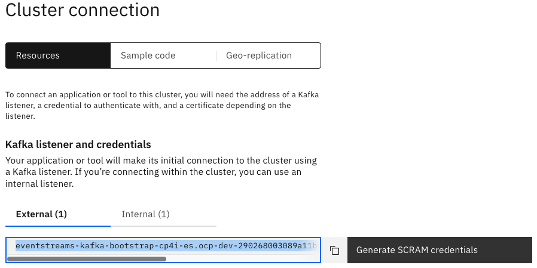
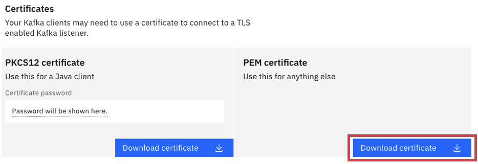
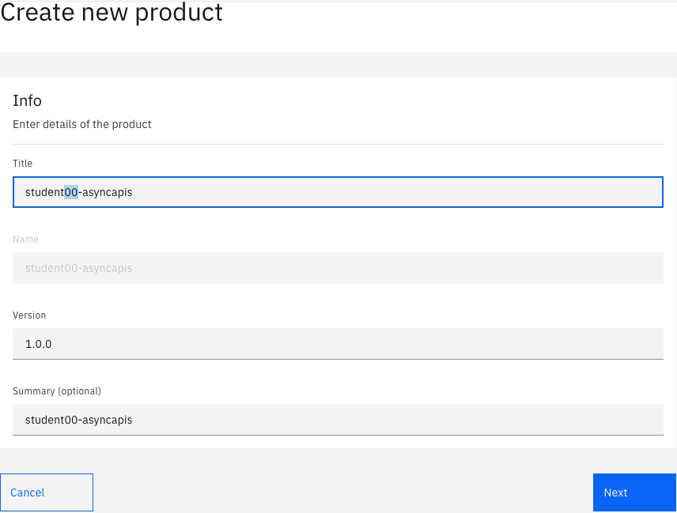
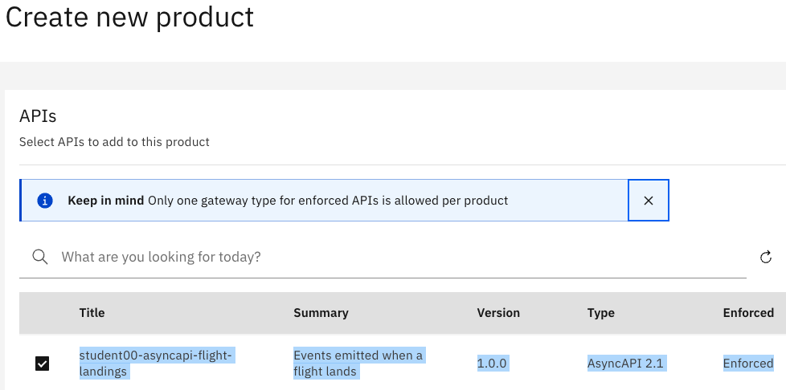
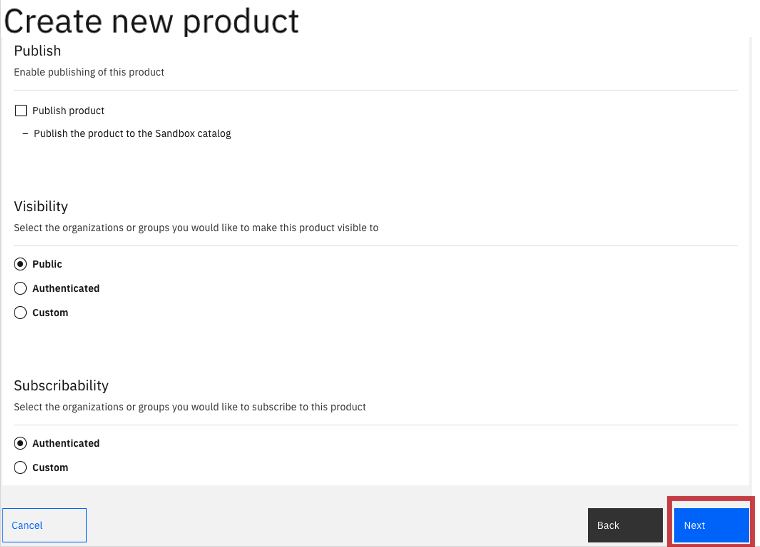
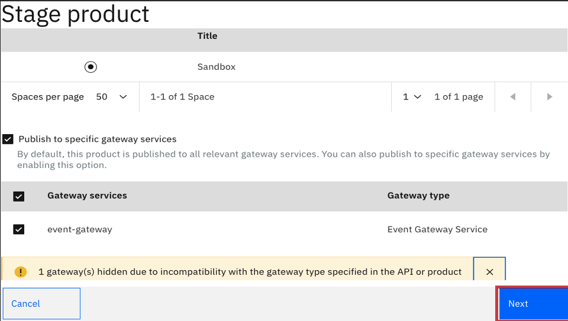
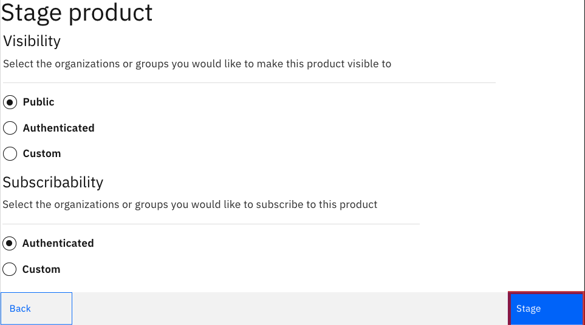
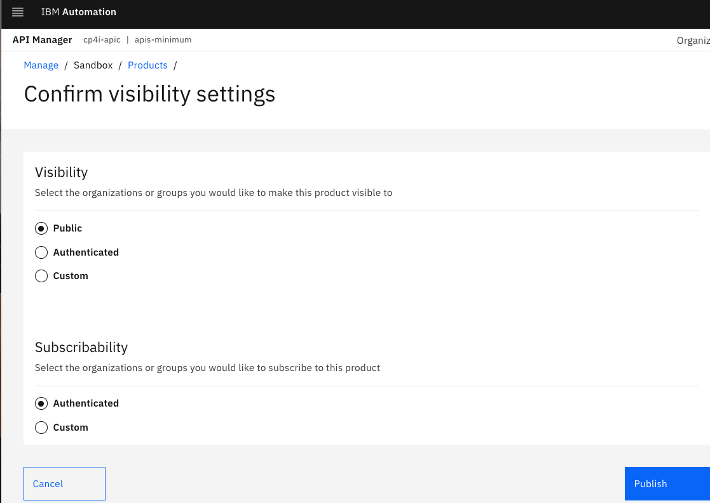
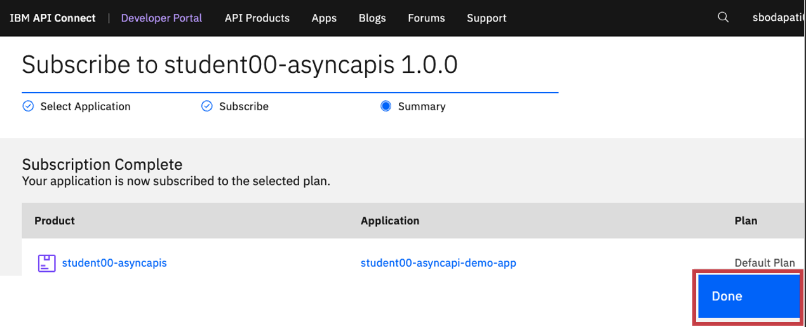

# IBM Cloud Pak for Integration - Creating AsyncAPI

In this lab, students will go through steps on how to create a Topic in Event Streams, and build an AsyncApi and publish to IBM API Connect Developer Portal and IBM Event Gateway.

<br>

# 1. IBM Event Streams

## Create Topic 

From the Cloud Pak for Integration Platform Navigator, open the IBM Event Streams Console. <br>

Create topic STUDENT00.FLIGHT.LANDINGS. <br>

Use default settings, and create the Topic. <br>

## Generate SCRAM Credentials


Important: <br>
Save Bootstrap server address into a Notepad <br>


Generate Scram Credentials <br>



<br>

### Important
Save the username, and password in a Notepad. <br><br>


Download es-cert.pem, es-cert.p12 certificates to Downloads folder. <br>

### Important
Save es-cert password into Notepad.
<br>



The Scram Credentials, and the es-cert.pem certificate will be used during AsyncApi configuration in IBM Api Connect. <br>

<br>
Create JKS file based on es-cert.p12. App Connect KafkaConnector's needs JKS format. <br>

```
cd ~/Downloads 
/usr/bin/keytool -importkeystore -srckeystore es-cert.p12 \
        -srcstoretype PKCS12 \
        -destkeystore es-cert.jks \
        -deststoretype JKS \
	-srcstorepass <password-of-pkcs12-certificate>  \
	-deststorepass passw0rd \
	-noprompt
```

The Scram Credentials, and the es-cert.jks certificate will be used in IBM App Connect Toolkit Flow to simulate flight landing events. <br>

### Important
By now you should have saved the below in Notepad, <br>
a) bootstrap address of your Event Streams Cluster, <br>
b) student00-scram-credentials / and the password <br>
c) es-cert's password <br>
d) es-cert.jks, and es-cert.jks's password (i.e passw0rd) <br><br>


# 2. Api Connect - Manager

## Create AsyncAPI

From the IBM Cloud Pak for Integration Platform Navigator, open the Api Management Console. <br>

From the Home page select "Develop APIs and products" tile.<br>

Add AsyncAPI! <br>


<br>
Title: student00-asyncapi-flight-landings<br>
Summary: Events emitted when a flight lands<br>
Bootstrap Servers: Copy/Paste the bootstrap address saved above<br>
Topic Name: STUDENT00.FLIGHT.LANDINGS<br>
Security Protocol: SASL_SSL<br>
SASL mechanism: SCRAM-SHA-512<br>
SASL Username: student00-scram-credentials<br>
SASL Password: Copy/Paste the Scram Password saved above<br>
Transport CA Certificate: Drag/Drop the es-cert.pem from the Downloads folder
<br><br>


<br><br>

<br><br>


## Edit the API

Edit the API to add the Flight Landing Event Schema.<br><br>
Click on the Source Icon as below,


Replace "message: {}" line as below <br>
 <br>
Double click "message: {}" to select/highlight the entire line. Now, copy and paste the below Avro schema.<br>

```
      message:
        name: landingEvent
        title: Flight landing event
        summary: Flight landing information
        description: >-
          This API provides a stream of events based on the landing of planes at
          Bodapati Airport
        schemaFormat: application/vnd.aai.asyncapi;version=2.0.0
        contentType: application/json
        payload:
          type: object
          required:
            - flight
            - terminal
            - passengers
          properties:
            flight:
              description: ID for the flight that has landed
              type: string
            terminal:
              description: Which terminal the flight has landed at
              type: string
            passengers:
              description: Number of passengers on the flight
              type: string
            additionalProperties: false
        examples:
          - payload: |
              { "flight" : "AI100",  "terminal" : "2", "passengers": "100"}
```
Save the API.<br><br>


## Create Product & Add API










<br>

## Publish the Product
Now, publish the AsyncApi's product to the IBM Api Connect Developer Portal, and to the IBM Event Gateway.






Navigate to API Manager Home (Home Icon on top left) --> Manage Catalogs, select Sandbox Catalog.

Publish the Product to APIC Developer Portal, and Event Gateway.




<br><br>

# 3. API Connect Developer Portal

Locate the developer portal Url, by navigating to API Manager Home (Home Icon on top left) --> Manage Catalogs, select Sandbox Catalog.

Click on "Catalog Settings" tab.


Click on Portal tab on left panel, and copy the Portal URL.


Signon to API Connect Developer Portal


## Subscribe to AsyncAPI

Select student00-asyncapis Product


Important: 
Copy and Save the Key (ClientId), and the Secret into Notepad. These will be used by the Async Client java application.


Select the new application that you just created.




<br><br>

# 4. Event Gateway Bootstrap certificate

Obtain Event Gateway bootstrap certificate, to be used by the Kafka Consumer programs. <br>
<br>

From the command line, logon to OpenShift CLI. <br>

```
oc login --token=sha256~xxxx --server=https://xxxx-coc-cluster:32167
```

```
$ cd ~/Downloads
$ oc project cp4i-apic
$ EVENT_GW_ROUTE_NAME=`oc get route | grep event-gw-client | awk '{print$1}'`
$ BOOTSTRAP_HOST=`oc get route $EVENT_GW_ROUTE_NAME -n cp4i-apic  -o jsonpath="{.spec.host}"`

$ echo -n | openssl s_client -connect $BOOTSTRAP_HOST:443 -servername $BOOTSTRAP_HOST -showcerts | openssl x509 > bootstrap.crt

$ /usr/local/bin/keytool -import -noprompt \
        -alias bootstrapca \
        -file bootstrap.crt \
        -keystore bootstrap.p12 -storepass passw0rd
$ /usr/local/bin/keytool -importkeystore -srckeystore bootstrap.p12 \
        -srcstoretype PKCS12 \
        -destkeystore bootstrap.jks \
        -deststoretype JKS \
	-srcstorepass passw0rd \
	-deststorepass passw0rd \
	-noprompt
```
<br>

Important: <br>
echo $BOOTSTRAP_HOST <br>
(Save BOOTSTRAP_HOST into Notepad) <br>
The BOOTSTRAP_HOST, bootstrap.p12, and password will be used in kafka-sonsole-sonsumer.sh program. <br>
The BOOTSTRAP_HOST, bootstrap.jks, and password will be used in java client application. <br>
<br>


<br>
<br>
<b> END OF LAB </b>
