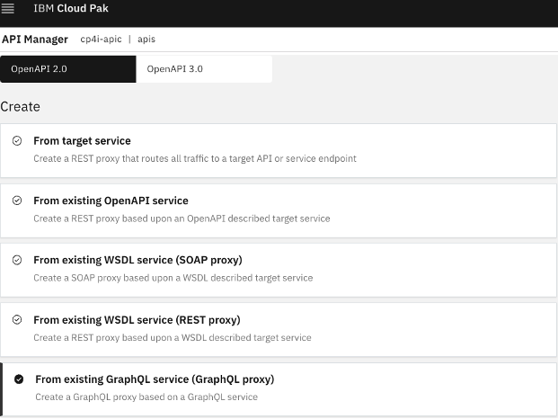
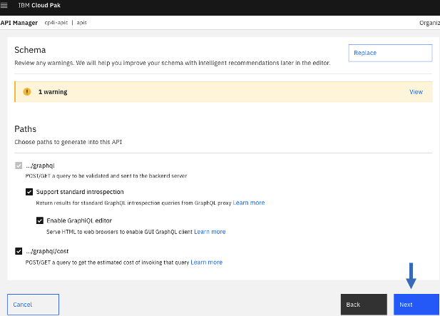
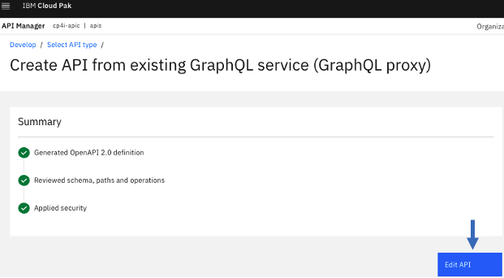
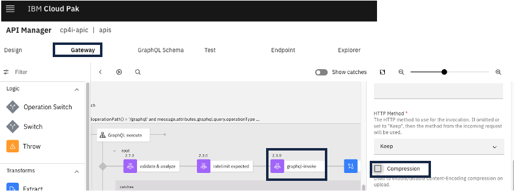

# lab 1: Create StepZen GraphQL Proxy for CustomerDatabase REST API 

## 1. Overview
In this lab, we will leverage an existing REST API to create StepZen GraphQL Proxy and then expose the GraphQL Proxy through ApiConnect. For the lab, we will be leveraging CustomerDatabaseV1 REST API deployed onto IBM AppConnect. <br>


<br>

## 2. Setup StepZen

If you do not have a StepZen account, then create one from stepzen.com. <br>

### 2.1 Getting Started

Click on "Getting Started" option from the StepZen Menu. Select "REST API". <br>


Follow the guided wizard and run the commands on the VDI.<br>

###  
Install the StepZen CLI on the VDI if not already installed.<br>
npm install -g stepzen <br>

Login with your your StepZen Account <br>
stepzen login -a kafrnubl <br>
Enter your Admin Key when prompted <br>
kafrnubl::stepzen.io+1000::xxxxxxxx
<br>


<br>

## 2.2 App Connect Dashboard - Capture CustomerDatabase API endpoints
From the Cloud Pak for Integration Platform Navigator, open App Connect Dashboard.<br>


Capture API endpoint for customers operation.<br>


similarly, capture API endpoint for customers/{customerId} operation.<br>

Save both endpoints into Notepad.<br>

## 2.3 StepZen CLI - import CustomerDatabase operations into StepZen Configuration

You will import customers, customers{id} operations into StepZen.<br>

Update below commands, replace API endpoint, stepzen Admin Key. <br>
```
# Get All Customers

stepzen import curl "http://ace-tk-customerdb-v1-http-cp4i-ace.ocp-dev-xxxxxx-0000.us-east.containers.appdomain.cloud/customerdb/v1/customers" --header "Authentication: kafrnubl::stepzen.io+1000::xxxxxxx"
? What would you like your endpoint to be called? api/customerdb_v1
Starting... done
Successfully imported curl data source into your GraphQL schema

# Get Customer by Id
stepzen import curl "http://ace-tk-customerdb-v1-http-cp4i-ace.ocp-dev-xxxxxxx-0000.us-east.containers.appdomain.cloud/customerdb/v1/customers/1" --header "Authentication: kafrnubl::stepzen.io+1000::xxxxxxxxx"

```

## 2.4 Tweak index.html files

Rename myQuery with a meaningful Query Name, example getCustomers, getCustomersById<br>

vi curl/index.html <br>
Rename myQuery with getCustomers.<br>
```
type RootEntry {
  address: String
  firstname: String
  id: Int
  lastname: String
}

type Query {
  getCustomers: [RootEntry]
    @rest(
      endpoint: "http://ace-tk-customerdb-v1-http-cp4i-ace.ocp-dev-xxxxx-0000.us-east.containers.appdomain.cloud/customerdb/v1/customers"
      headers: [
        { name: "authentication", value: "$authentication_cd1520b06f;" }
      ]
      configuration: "curl_import_config"
    )
}
```
Save and quit.<br>

vi curl-01/index.html <br>
Rename myQuery with getCustomerById and enclose id param as below.<br>
```
type Root {
  address: String
  firstname: String
  id: Int
  lastname: String
}

type Query {
  getCustomerById(id: ID): Root
    @rest(
      endpoint: "http://ace-tk-customerdb-v1-http-cp4i-ace.ocp-dev-xxxx-0000.us-east.containers.appdomain.cloud/customerdb/v1/customers/$id;"
      headers: [
        { name: "authentication", value: "$authentication_cd1520b06f;" }
      ]
      configuration: "curl_import_config"
    )
}
```
Save and quit. <br>


## 3. StepZen CLI - Deploy

stepzen start <br>

That should deploy GraphQL Queries into StepZen Account, output below. <br>
```
sbodapati@Sudhakars-MBP stepzen2 % stepzen start
Deploying api/customerdb_v1 to StepZen... done in 2.8s 🚀
  ✓ 🔐 https://kafrnubl.stepzen.net/api/customerdb_v1/__graphql
  ✓ 🔐 wss://kafrnubl.stepzen.net/stepzen-subscriptions/api/customerdb_v1/__graphql (subscriptions)

You can test your hosted API with curl:

curl https://kafrnubl.stepzen.net/api/customerdb_v1/__graphql \
   --header "Authorization: Apikey $(stepzen whoami --apikey)" \
   --header "Content-Type: application/json" \
   --data-raw '{
     "query": "query SampleQuery { __schema { description queryType { fields {name} } } }"
   }'

Or explore it with GraphiQL at
   https://dashboard.stepzen.com/explorer?endpoint=api%2Fcustomerdb_v1
```


## 4. StepZen Dashboard

Open the above Url (explore it with GraphQL) in the browser. That should open SteoZen GraphQL Dashboard. <br>
https://dashboard.stepzen.com/explorer?endpoint=api%2Fcustomerdb_v1
<br>


## 5. Test StepZen GraphQL Queries
From the StepZen Dashboard test both the queries as below.<br>


## 6. Create GraphQL API in ApiConnect

### 6.1 ApiConnect Manager
From the ApiManager UI, Add > API, select GraphQL as below. <br> 










Uncheck Compression flag, from Gateway Tab > select graphql-invoke action (it will be in the middle of the flow).<br>



### 6.2 Testing the GraphQL API from ApiConnect Manager

Online the Api, and that will enable the "Test" tab. <br>

#### 6.2.1 Run getCustomers Query <br>
```
{
 getCustomers {
    id
    firstname
    lastname
    address
  }
}
```


#### 6.2.2 Run getCustomerbyId Query <br>
```
{
  getCustomerById(id: "2") {
    firstname
    lastname
    address
  }
}
```


#### 6.2.3 Run both queries together
```
{
  getCustomerById(id: "2") {
    firstname
    lastname
    address
  }

  getCustomers {
    id
    firstname
    lastname
    address
  }
}
```
<br>
<br>
<br>


### Congratulations!!!
You have successfully created a StepZen GraphQL Proxy in Api Connect!!!