# lab 1: GraphQL - CustomerDatabaseV3 REST API 


---

# Table of Contents
- [1. Overview](#overview)

- [2. IBM App Connect Dashboard ](#ace-dashboard)
  * [2a. App Connect Dashboard - Deploy CustomerDatabaseV3](#ace-dashboard-deploy)
  * [2b. App Connect Dashboard - Capture CustomerDatabase API Endpoints](#ace-dashboard-endpoints)

- [3. StepZen CLI - Expose CustomerDatabaseV3 endpoints into GraphQL Engine](#stepzen)
  * [3a. login to APIC GraphQL Server](#stepzen-login)
  * [3b. Import /customers, /customers/getCustomerById operations ](#stepzen-import)
  * [3c. Tweak index.graphql files ](#stepzen-index-files)

- [4. StepZen CLI - Deploy & Start](#stepzen-start)

- [5. StepZen Local Testing](#stepzen-local-testing)

- [6. IBM API Connect - Expose GraphQL API](#apic-expose)
  * [6a. IBM API Connect Manager](#apic-manager)
  * [6b. Publish the GraphQL API into the API Connect Developer Portal](#apic-portal)

- [7. IBM API Connect Dev Portal - Testing API Connect GraphQL Endpoint](#apic-portal-testing)

- [8. References](#references)

---

## 1. Overview <a name="overview"></a>
In this lab, we will leverage an existing REST API to create StepZen GraphQL Proxy and then expose the GraphQL Proxy through ApiConnect. For the lab, we will be leveraging CustomerDatabaseV3 REST API deployed onto IBM AppConnect. <br>


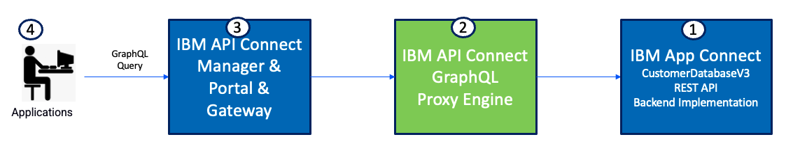


## 2. IBM App Connect Dashboard <a name="ace-dashboard"></a>

### 2a App Connect Dashboard - Deploy CustomerDatabaseV3 <a name="ace-dashboard-deploy"></a>

Download CustomerDatabaseV3 from <br>
[<b><u>here</u></b>](./src/CustomerDatabaseV3.bar)

Open App Connect Dashboard from the Cloud Pak for Integration Platform Navigator and deploy the bar file.<br>

Select \"Quickstart Integration\" tile =-> drag and drop CustomerDatabaseV3.bar --> \<Next\>\<Next\>.

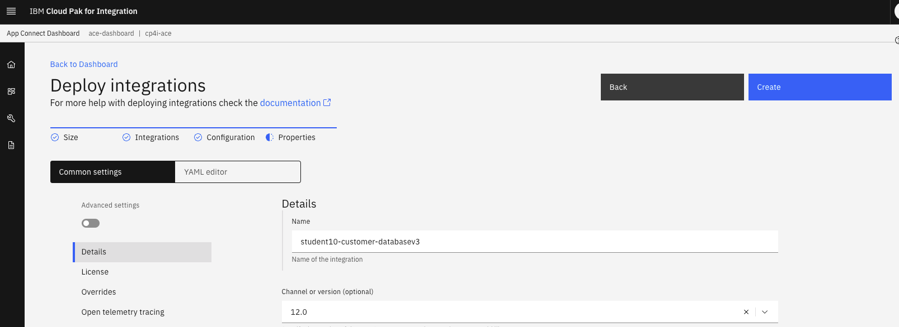

Click \"Create\". <br>
Refresh the page in about a minute and make sure student(n)-customer-database-v3 Integration Tile is in Ready state.

<br>

### 2b App Connect Dashboard - Capture CustomerDatabase API Endpoints <a name="ace-dashboard-endpoints"></a>

In the App Connect Dashboard click on student(n)-customer-database-v3 tile. <br>
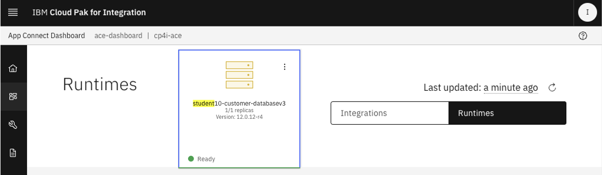

Click on the Integration Runtime student(n)-customer-database-v3. <br>

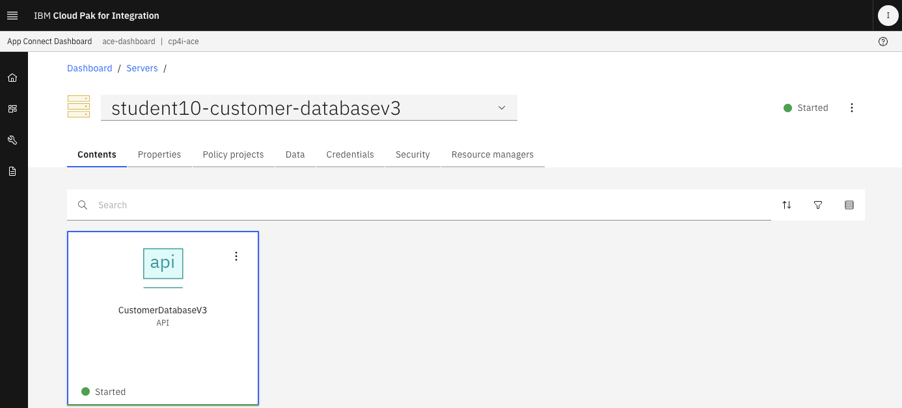

Capture API endpoint for GET /customers operation.<br>
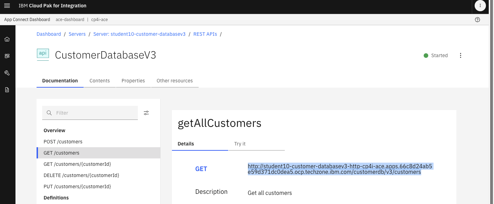

Copy and paste the URL to Notepad or Scratchpad. <br>

Similarly, capture API endpoint for GET /customers/{customerId} operation.<br>

Save the endpoints to the Notepad.<br>

<br>

## 3. StepZen CLI - Expose CustomerDatabaseV3 endpoints into GraphQL Engine <a name="stepzen"></a>

### 3a login to APIC GraphQL Server <a name="stepzen-login"></a>

<b>NOTE: Do these steps on the VDI.</b>
<br>

<b>stepzen login using adminkey</b><br>
Note: your instructor will provide you the adminkey.<br>
```
stepzen login -a graphql -k graphql::local.io+1000::d370c120d5b8c2c670615a4e3ac0d88aa4378f41d07a7f78c8b7642dd11ac563 apps.66c8d24ab5e59d371dc0dea5.ocp.techzone.ibm.com
```

### 3b Import /customers, /customers/getCustomerById operations <a name="stepzen-import"></a>

<br>
You will import customers, customers{id} operations into API Connect GraphQL engine.<br>

Update below commands, replace API endpoint, stepzen Admin Key. <br>
```
# Get All Customers

stepzen import curl "http://student10-customer-databasev3-http-cp4i-ace.apps.66c8d24ab5e59d371dc0dea5.ocp.techzone.ibm.com/customerdb/v3/customers" --query-name=getCustomers

? What would you like your endpoint to be called? <b>api/student10-customer-database-v3</b>
Starting... done
Successfully imported curl data source into your GraphQL schema

# Get Customer by Id
stepzen import curl "http://student10-customer-databasev3-http-cp4i-ace.apps.66c8d24ab5e59d371dc0dea5.ocp.techzone.ibm.com/customerdb/v3/customers/1" --query-name=getCustomerById

```

### 3c Tweak index.graphql files <a name="stepzen-index-files"></a>

```
vi curl-01/index.graphql
```

Remove Address segment - this is already present in curl/index.graphql. <br>

Append (id: ID) to getCustomerById as below.<br>

```
type Root {
  address: Address
  email: String
  firstname: String
  id: Int
  lastname: String
}

type Query {
  getCustomerById(id: ID): Root
    @rest(
      endpoint: "http://student10-customer-databasev3-http-cp4i-ace.apps.66c8d24ab5e59d371dc0dea5.ocp.techzone.ibm.com/customerdb/v3/customers/1"
    )
}
```
Save and quit. <br>


## 4. StepZen CLI - Deploy & Start <a name="stepzen-deploy"></a>


#### Disable security - Copy the below 5 lines as-is, and paste in the command line. This will create config.yaml
```
echo "access:
  policies:
    - type: Query
      policyDefault:
        condition: true" > config.yaml 
``` 

Run command; <br>
```
stepzen start <br>
```

That should deploy GraphQL Queries into StepZen Account, output below. <br>
```
sbodapati@MacBookPro customerdatabasev3 % stepzen start
(node:17221) [DEP0040] DeprecationWarning: The `punycode` module is deprecated. Please use a userland alternative instead.
(Use `node --trace-deprecation ...` to show where the warning was created)
Deploying api/student10-customer-database-v3 to StepZen... done in 284ms 🚀
  ✓ 🔐 https://graphql.apps.66c8d24ab5e59d371dc0dea5.ocp.techzone.ibm.com/api/student10-customer-database-v3/__graphql
  ✓ 🔐 wss://graphql.apps.66c8d24ab5e59d371dc0dea5.ocp.techzone.ibm.com/stepzen-subscriptions/api/student10-customer-database-v3/__graphql (subscriptions)

You can test your hosted API with curl:

curl https://graphql.apps.66c8d24ab5e59d371dc0dea5.ocp.techzone.ibm.com/api/student10-customer-database-v3/__graphql \
   --header "Authorization: Apikey $(stepzen whoami --apikey)" \
   --header "Content-Type: application/json" \
   --data-raw '{
     "query": "query SampleQuery { __schema { description queryType { fields {name} } } }"
   }'

Or explore it with GraphiQL at
   http://localhost:5001/api/student10-customer-database-v3


Watching ~/xibm_ts/sb_demos/apiconnect/apic-graphql/customerdatabasev3 for changes...

```

Capture and save graphql endpoint, and \"explore it with GraphiQL at" URL. <br>
```
1) https://graphql.apps.66c8d24ab5e59d371dc0dea5.ocp.techzone.ibm.com/api/student10-customer-database-v3/__graphql
2) http://localhost:5001/api/student10-customer-database-v3
```

## 5. StepZen Local Testing <a name="stepzen-local-testing"></a>

Open the above Url <b> (explore it with GraphQL) </b> in the browser. That should open API Connect GraphQL Test Utility. <br>
   http://localhost:5001/api/student10-customer-database-v3
<br>

From the GraphQL Test Tool test both the queries as below.<br>

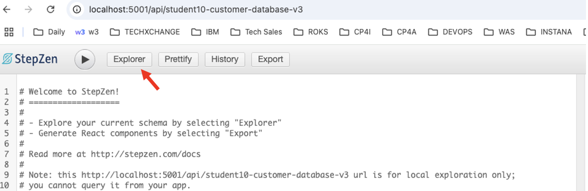

Click the Explore tab. <br>

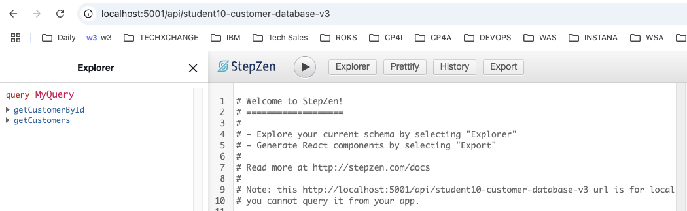

Click on getCustomers query, select all fields and click on the Execute button.<br>

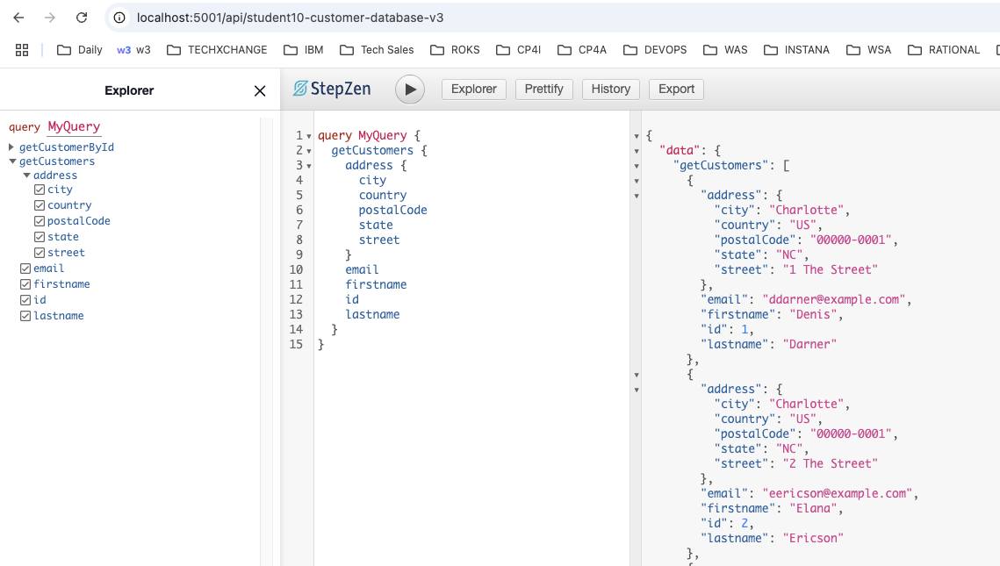

Similary, select getCustomerById and test. <br>

also, run both queries at once as below. <br>

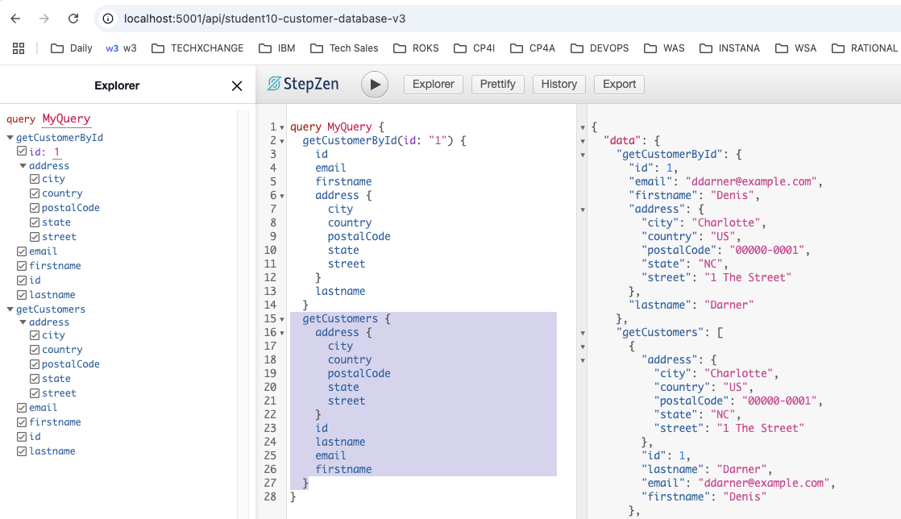


## 6. IBM API Connect - Expose GraphQL API <a name="apic-expose"></a>

We will expose the GraphQL Endpoint into API Connect so that the API is secured, and consumed securely by the consumers. <br>

### 6a IBM API Connect Manager <a name="apic-manager"></a>
From the ApiManager UI, Add > API, select GraphQL as below. <br> 

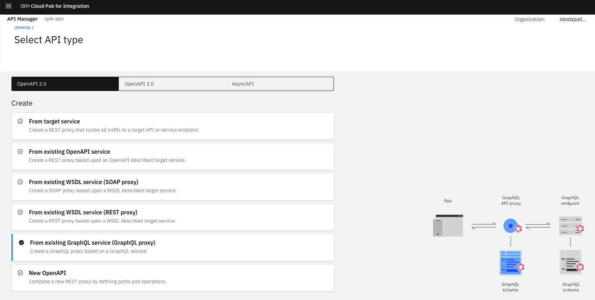

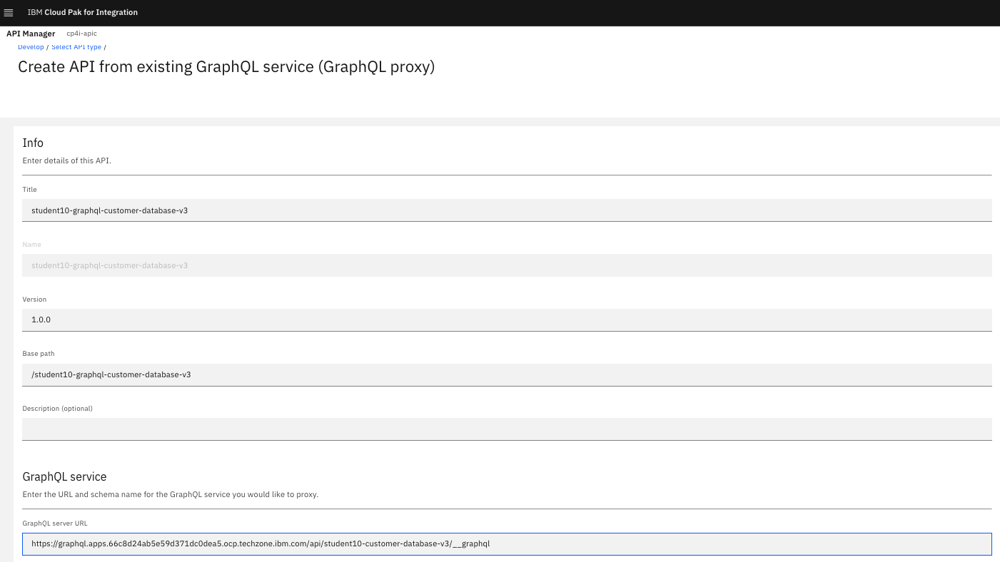

Enter \"GraphQL service\" - Grab GraphQL URL from \"stepzen start\" command output. <br>

example;
```
https://graphql.apps.66c8d24ab5e59d371dc0dea5.ocp.techzone.ibm.com/api/student10-customer-database-v3/__graphql
```


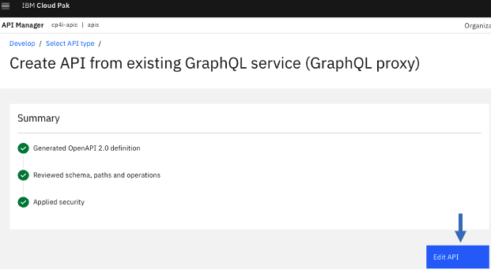

<!--
Uncheck Compression flag, from Gateway Tab > select graphql-invoke action (it will be in the middle of the flow).<br>

-->

<br>

<!--

### 6b Testing the GraphQL API from ApiConnect Manager 

Online the Api, and that will enable the "Test" tab. <br>

#### 6.2.1 Run getCustomers Query <br>
```
{
 getCustomers {
    id
    firstname
    lastname
    address
  }
}
```
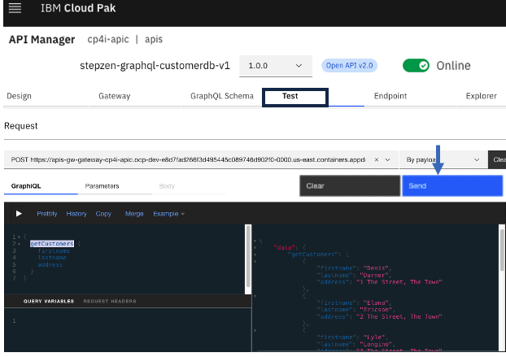

#### 6.2.2 Run getCustomerbyId Query <br>
```
{
  getCustomerById(id: "2") {
    firstname
    lastname
    address
  }
}
```
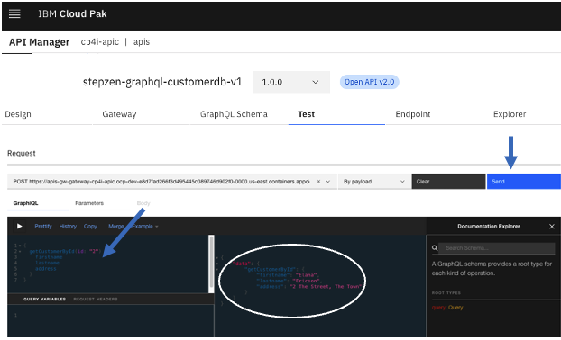

#### 6.2.3 Run both queries together
```
{
  getCustomerById(id: "2") {
    firstname
    lastname
    address
  }

  getCustomers {
    id
    firstname
    lastname
    address
  }
}
```
-->


## 6b Publish the GraphQL API into the API Connect Developer Portal<a name="apic-portal"></a>

Create a new product in API Connect, name it student(n)-product. <br>

Add student(n)-graphql-customer-database-v3 api into the product. <br>

Publish the Product.
<br>

Open API Connect Developer Portal, and logon to the portal.
<br>

Create an Application, save clientid, and secret. <br>

Subscribe to the Product student(n)-product to the application you created above. <br>


Now, click on the Product and the API. Capture the Endpoint.<br>
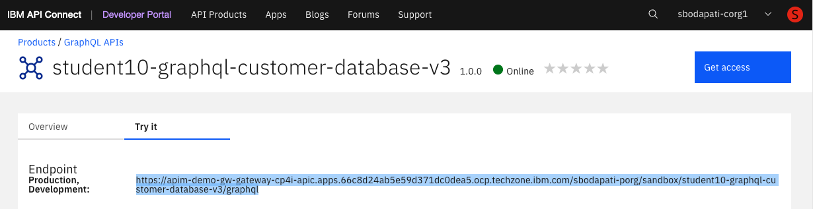

<br>

## 7. API Connect Dev Portal - Testing API Connect GraphQL Endpoint <a name="apic-portal-testing"></a>
Copy and paste the Endpoint into a new brower tab.<br>

Enter the Application clientID you captured above.<br>

Enter the below getCustomers Gra[hQL Query into the body.<br>
```
query MyQuery {
  getCustomers {
    id
    lastname
    email
    firstname
    address {
      city
      country
      postalCode
      state
      street
    }

  }
}
```
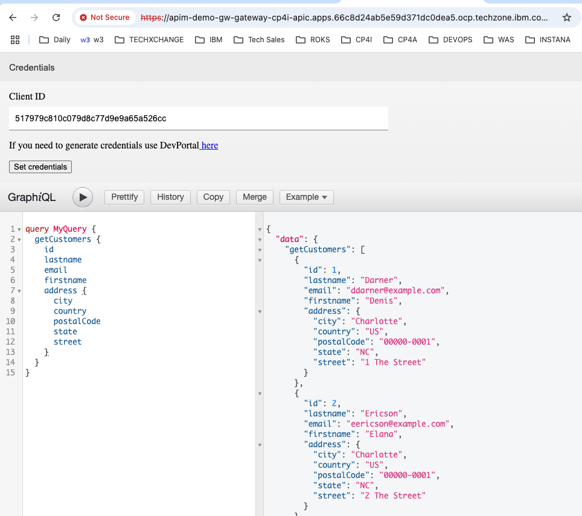

Similarly test getCustomerById GraphQL Query.<br>
Enter the below getCustomerById GraphQL Query into the body.<br>
```
query MyQuery {
  getCustomerById(id: "1") {
    id
    email
    firstname
    lastname
    address {
      city
      country
      postalCode
      state
      street
    }
  }
}
```

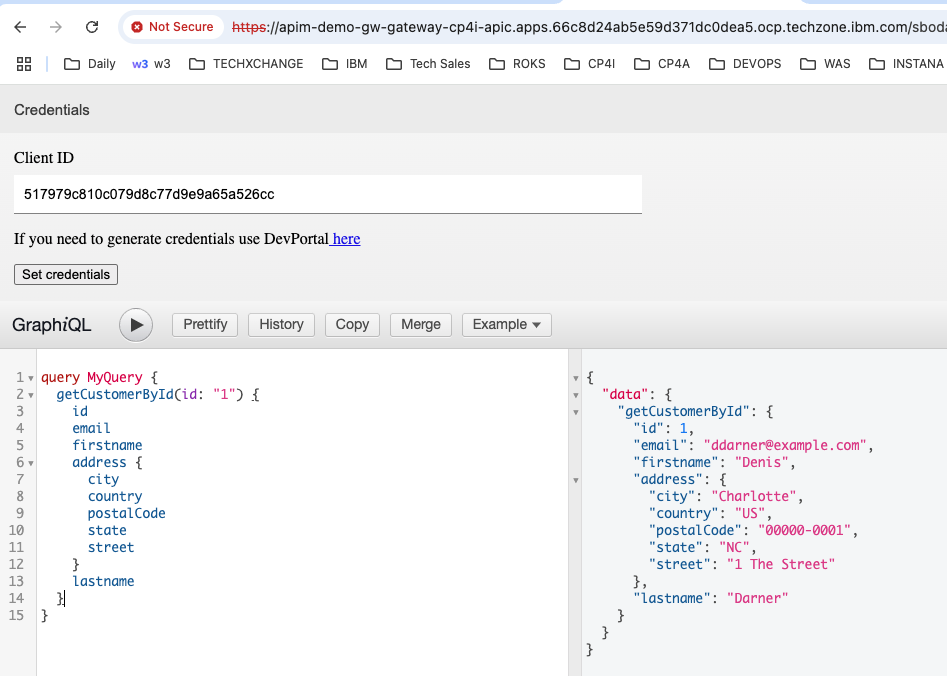

Now, run two queries in one request as below. <br>
```
query MyQuery {
  getCustomerById(id: "1") {
    id
    email
    firstname
    lastname
    address {
      city
      country
      postalCode
      state
      street
    }
  }
  getCustomers {
    id
    lastname
    email
    firstname
    address {
      city
      country
      postalCode
      state
      street
    }
  }
}
```
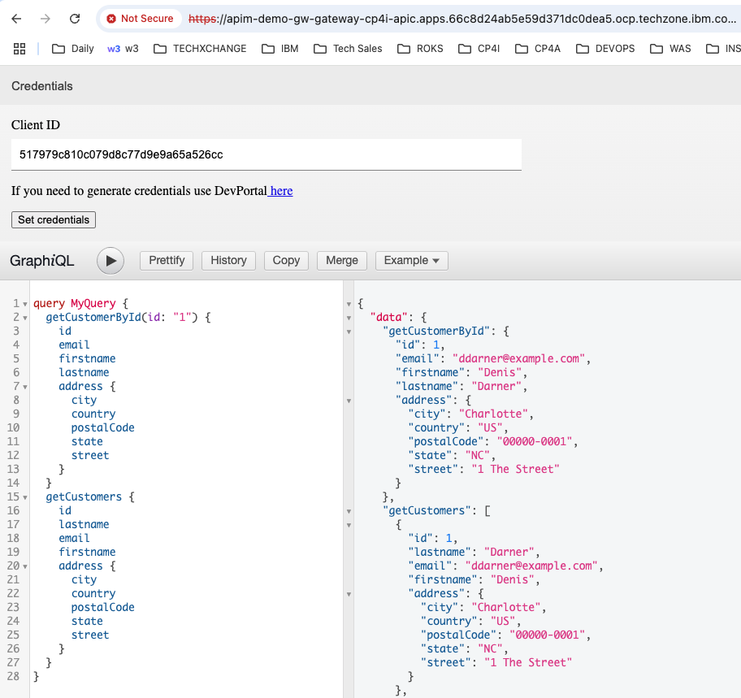

<br><br><br><br>
### Congratulations!!!
You have successfully created a StepZen GraphQL Proxy in Api Connect!!!


## 8. References <a name="references"></a>
Customer Database V3 - ACE Project Interchange file.

Download CustomerDatabaseV3-PIF.zip from <br>
[<b><u>here</u></b>](./src/CustomerDatabaseV3-PIF.zip)
