# lab 2: Create API Connect GraphQL GraphQL Proxy for Salesforce Account REST API 

## 1. Overview
In this lab, we will leverage an existing REST API to create API Connect GraphQL GraphQL Proxy and then expose the GraphQL Proxy through ApiConnect. For the lab, we will be leveraging Salesforce Account REST API deployed onto IBM AppConnect. A Salesforce Account Object has about 100+ fields, by using GraphQL one can Query for fields that they are interested thus reducing the response payload & network traffic.<br>

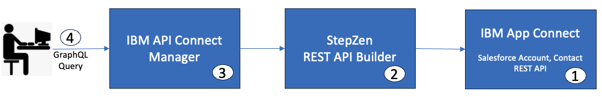

(1) Deploy App Connect Toolkit bar file into Cloud Pak for Integration & App Connect Dashboard. <br>
(2) Capture REST API Endpoints for getAccounts, getAccount methods.<br>
(3) Create API Connect GraphQL Configurations for both methods.<br>
(4) Deploy to API Connect GraphQL Server.<br>
(5) Test the GraphQL Queries in API Connect GraphQL Console.<br>
(6) Extract API Connect GraphQL URL.<br>
(7) Expose API Connect GraphQL URL into IBM API Connect. <br>
(8) Test GraphQL API from API Connect Developer Portal. <br>
<br>


## 2 App Connect Dashbard

In this section, you will deploy a pre-built App Connect Toolkit Rest API's that retrieves Account records from Salesforce.<br>

### 2.1 App Connect Dashboard - Deploy Toolkit API's

From the Cloud Pak for Integration Platform Navigator, open App Connect Dashboard user interface.<br>

<b>Download the bar file <br>
[SF_ACCOUNT_API.bar](./barfiles/SF_ACCOUNT_API.bar)

Deploy the barfile <br>
</b>
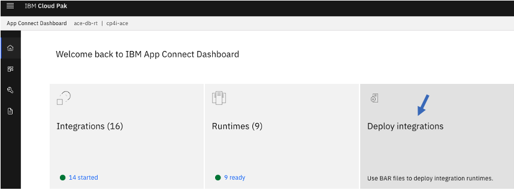

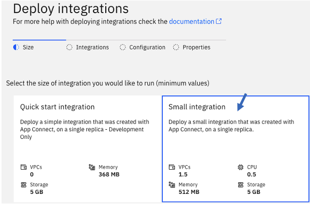

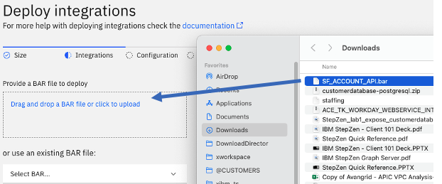

Click \<Next\> to "Create configurations".<br>

Click on "Create configuration". <br>
Populate the values. <br>
<b>type:</b> "setdbparms.txt" <br>
<b>Name:</b> \<user1\>-setdbparms-salesforce-conf , replace user1 with your cloud pak for integration login userid.<br>
<b>Description:</b> Salesforce credentials <br>
<b>setdbparms.txt:</b> mqsisetdbparms -w /home/aceuser/ace-server -n salesforce::SF1 -u \<salesforce-userid\> -p \<password-and-token\> -c \<clientid\> -s \<secret\>

Hit <b>"Create"</b> Button to create the configuration. <br>

Click "Next"

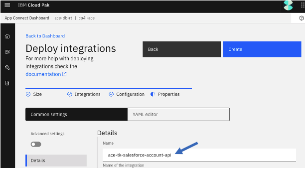

Click "Create" to create Integration Server/Runtime instance.<br>

Refresh the screen in one minute, and make sure ace-tk-salesforce-account-api is in Ready state. <br>.


### 2.2 App Connect Dashboard - Test the API

From the App Connect Dashboard, click on ace-tk-salesforce-account-api integration server/runtime tile. That will open the Rest API and it's operations as below.<br>

Try /getAccounts operation. <br>
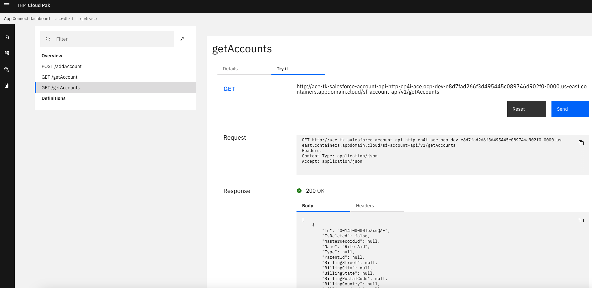

Check the output, should return several Accounts.<br>

Capture Id value from the output, example "0014T00000IeZxuQAF". <br>
We will use this Id, to test getAccount operation.<br>
<br>
Try /getAccount operation, and enter the Id value captured above.
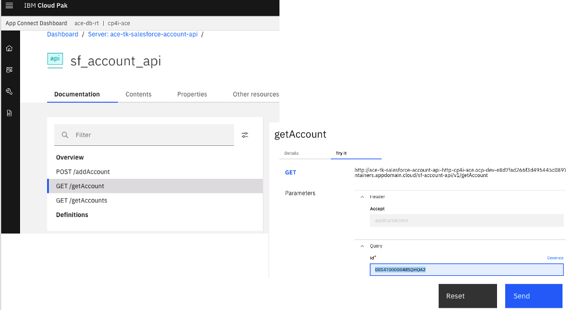


Stay on this page, continue to below section to capture API endpoints for API Connect GraphQL configuration.<br><br>

### 2.2 App Connect Dashboard - Capture REST API endpoints.

Capture Salesforce Account REST API endpoint(s), and save to Notepad. <br>

<br>
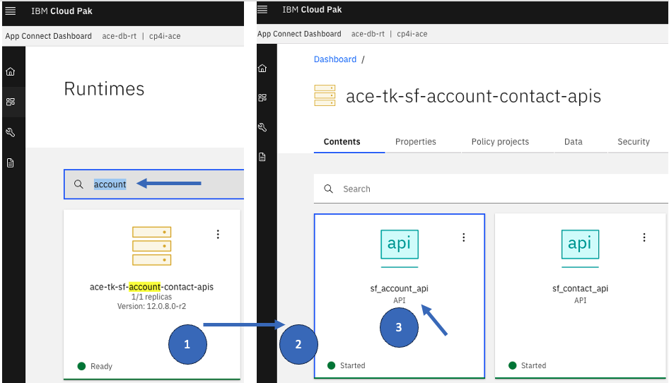

Click on the Integration Server/Runtime to display the APIs. <br><br>
Select sf_account_api to view the operations of the API.<br>

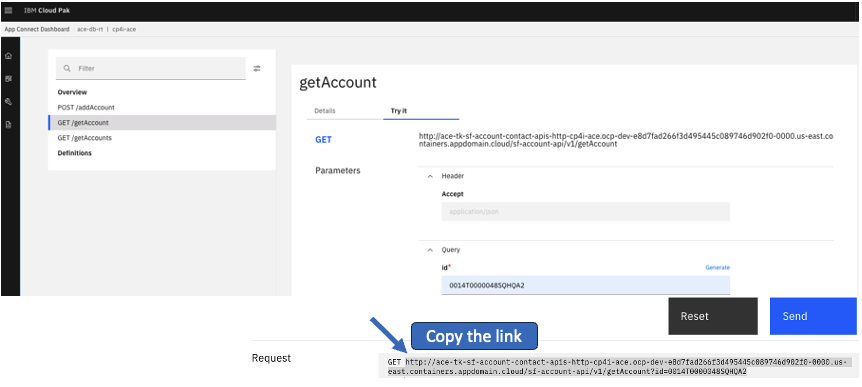

Capture API endpoint of the Account API.<br>
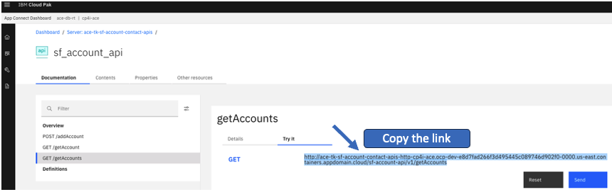

Save both endpoints into Notepad.<br>


## 3. API Connect GraphQL

### 3.1 Admin Key
From the browser logon to API Connect GraphQL.com. <br>

Capture the Admin Key.<br>
Navigate to "Account" on the left, and Copy the "Admin Key" to the Notepad.<br>

<br>

### 3.2 API Connect GraphQL CLI (on the VDI)

Login with your your API Connect GraphQL Account <br>

API Connect GraphQL login -a kafrnubl <br>
Enter the "Admin Key" when prompted <br>


## 3.3 API Connect GraphQL CLI - import Salesforce Account API operations into API Connect GraphQL Configuration

You will be importing getAccount, getAccounts operations into API Connect GraphQL.<br>

Update below commands, replace API endpoint, API Connect GraphQL Admin Key. <br>
```

mkdir API Connect GraphQL-salesforce-account-api

cd API Connect GraphQL-salesforce-account-api

# Copy the below 5 lines as-is, and paste in the command line. This will create config.yaml
echo "access:
  policies:
    - type: Query
      policyDefault:
        condition: true" > config.yaml 


# Get Salesforce Account by ID Operation importing
API Connect GraphQL import curl "http://ace-tk-salesforce-account-api-http-cp4i-ace.ocp-dev-e8d7fad266f3d495445c089746d902f0-0000.us-east.containers.appdomain.cloud/sf-account-api/v1/getAccount?id=0014T0000048SQHQA2" --header "Authentication: <REPLACE-WITH-API Connect GraphQL-ADMIN-KEY>"
? What would you like your endpoint to be called? api/salesforce-account-api
Starting... done
Successfully imported curl data source into your GraphQL schema

# Get Salesforce Accounts
API Connect GraphQL import curl "http://ace-tk-salesforce-account-api-http-cp4i-ace.ocp-dev-e8d7fad266f3d495445c089746d902f0-0000.us-east.containers.appdomain.cloud/sf-account-api/v1/getAccounts" --header "Authentication: <REPLACE-WITH-API Connect GraphQL-ADMIN-KEY>"

```

## 3.4 Tweak index.html files

Rename myQuery with a meaningful Query Name, example getAccounts, getAccountById<br>

vi curl/index.html <br>
Rename myQuery with getAccountById.<br>
```
type Query {
  getAccountById(id: String): Root
    @rest(
      endpoint: "http://ace-tk-salesforce-account-apis-http-cp4i-ace.ocp-dev-e8d7fad266f3d495445c089746d902f0-0000.us-east.containers.appdomain.cloud/sf-account-api/v1/getAccount"
      headers: [
        { name: "authentication", value: "$authentication_cd1520b06f;" }
      ]
      configuration: "curl_import_config"
    )
```

Delete the highlighted 4 lines. This is to disable security.<br>


Save and quit.<br>

vi curl-01/index.html <br>
Rename myQuery with getAccounts.<br>
REMOVE 4 lines as you did in the above (headers section, configuration). This is to disable security.<br>
```
type Query {
  getAccounts: [RootEntry]
    @rest(
      endpoint: "http://ace-tk-salesforce-account-api-http-cp4i-ace.ocp-dev-e8d7fad266f3d495445c089746d902f0-0000.us-east.containers.appdomain.cloud/sf-account-api/v1/getAccounts"
      headers: [
        { name: "authentication", value: "$authentication_cd1520b06f;" }
      ]
      configuration: "curl_import_config"
    )
```

Remove Attributes, BillingAddress Sections as they are duplicate segments under curl, and curl-01.<br>

vi curl-01/index.html <br>
```
type Attributes {
  type: String
  url: String
}
type BillingAddress {
  city: String
  country: String
  geocodeAccuracy: JSON
  latitude: JSON
  longitude: JSON
  postalCode: Int
  state: String
  street: String
}
```
Save and quit. <br>


## 4. API Connect GraphQL - Deploy 

In this section you will deploy the salesforce-account-api to API Connect GraphQL server.<br>

API Connect GraphQL start <br>

That should deploy GraphQL Queries into API Connect GraphQL Account, output below. <br>
```
sbodapati@Sudhakars-MBP API Connect GraphQL2 % API Connect GraphQL start
Deploying api/salesforce-account-api to API Connect GraphQL... done in 2.5s 🚀
  ✓ 🔐 https://kafrnubl.API Connect GraphQL.net/api/salesforce-account-api/__graphql
  ✓ 🔐 wss://kafrnubl.API Connect GraphQL.net/API Connect GraphQL-subscriptions/api/salesforce-account-api/__graphql (subscriptions)

You can test your hosted API with curl:

curl https://kafrnubl.API Connect GraphQL.net/api/salesforce-account-api/__graphql \
   --header "Authorization: Apikey $(API Connect GraphQL whoami --apikey)" \
   --header "Content-Type: application/json" \
   --data-raw '{
     "query": "query SampleQuery { __schema { description queryType { fields {name} } } }"
   }'

Or explore it with GraphiQL at
   https://dashboard.API Connect GraphQL.com/explorer?endpoint=api%2Fsalesforce-account-api
```


## 5. API Connect GraphQL Dashboard

Open the above Url (explore it with GraphQL) in the browser. That should open SteoZen GraphQL Dashboard. <br>
https://dashboard.API Connect GraphQL.com/explorer?endpoint=api%2Fsalesforce-account-api
<br>


### 5.1 API Connect GraphQL GraphQL Query Testing

From the API Connect GraphQL Dashboard test both the queries as below.<br>


Run getAccounts with all fields.<br>

```
 query getAccounts {
  getAccounts {
    AccountNumber
        AccountSource
        Active__c
        AnnualRevenue
        BillingAddress{
            city
            country
            geocodeAccuracy
            latitude
            longitude
            postalCode
            state
            street
        }
        BillingCity
        BillingCountry
        BillingGeocodeAccuracy
        BillingLatitude
        BillingLongitude
        BillingPostalCode
        BillingState
        BillingStreet
        CleanStatus
        CreatedById
        CreatedDate
        CustomerPriority__c
        DandbCompanyId
        Description
        DunsNumber
        Fax
        Id
        Industry
        IsDeleted
        Jigsaw
        JigsawCompanyId
        LastActivityDate
        LastModifiedById
        LastModifiedDate
        LastReferencedDate
        LastViewedDate
        MasterRecordId
        NaicsCode
        NaicsDesc
        Name
        NumberOfEmployees
        NumberofLocations__c
        OwnerId
        Ownership
        ParentId
        Phone
        PhotoUrl
        Rating
        SLAExpirationDate__c
        SLASerialNumber__c
        SLA__c
        ShippingAddress {
          city
          country
          geocodeAccuracy
          latitude
          longitude
          postalCode
          state
          street
        }
        ShippingCity
        ShippingCountry
        ShippingGeocodeAccuracy
        ShippingLatitude
        ShippingLongitude
        ShippingPostalCode
        ShippingState
        ShippingStreet
        Sic
        SicDesc
        Site
        SystemModstamp
        TickerSymbol
        Tradestyle
        Type
        UpsellOpportunity__c
        Website
        YearStarted
        attributes{
            type
            url
        }
        nextPageToken
  }
}

```

<br><br>


Run getAccounts - smaller set of fields.<br>

```
query getAccounts {
  getAccounts {
    Id
    AccountNumber
    Name
    AnnualRevenue
    BillingAddress {
      city
      country
      postalCode
      state
      street
    }
  }
}
```


Run getAccountById by Account Id with all fields.<br>

```
{
    getAccountById(id: "0014T0000048SQHQA2"){
        AccountNumber
        AccountSource
        Active__c
        AnnualRevenue
        BillingAddress{
            city
            country
            geocodeAccuracy
            latitude
            longitude
            postalCode
            state
            street
        }
        BillingCity
        BillingCountry
        BillingGeocodeAccuracy
        BillingLatitude
        BillingLongitude
        BillingPostalCode
        BillingState
        BillingStreet
        CleanStatus
        CreatedById
        CreatedDate
        CustomerPriority__c
        DandbCompanyId
        Description
        DunsNumber
        Fax
        Id
        Industry
        IsDeleted
        Jigsaw
        JigsawCompanyId
        LastActivityDate
        LastModifiedById
        LastModifiedDate
        LastReferencedDate
        LastViewedDate
        MasterRecordId
        NaicsCode
        NaicsDesc
        Name
        NumberOfEmployees
        NumberofLocations__c
        OwnerId
        Ownership
        ParentId
        Phone
        PhotoUrl
        Rating
        SLAExpirationDate__c
        SLASerialNumber__c
        SLA__c
        ShippingAddress
        ShippingCity
        ShippingCountry
        ShippingGeocodeAccuracy
        ShippingLatitude
        ShippingLongitude
        ShippingPostalCode
        ShippingState
        ShippingStreet
        Sic
        SicDesc
        Site
        SystemModstamp
        TickerSymbol
        Tradestyle
        Type
        UpsellOpportunity__c
        Website
        YearStarted
        attributes{
            type
            url
        }
        nextPageToken
    }
}
```


Run getAccountById by Account Id with smaller set of fields.<br>
```
{
  getAccountById(id: "0014T0000048SQHQA2") {
    Id
    AccountNumber
    Name
    AnnualRevenue
    BillingAddress {
      city
      country
      postalCode
      state
      street
    }
  }
}
```


RUNNING multiple queries together.<br>

```
query MyQuery {
  getAccountById(id: "0014T0000048SQHQA2") {
    Id
    AccountNumber
    Name
    AnnualRevenue
    BillingAddress {
      city
      country
      postalCode
      state
      street
    }
  }
  getAccounts {
    Id
    AccountNumber
    Name
    AnnualRevenue
    BillingAddress {
      city
      country
      postalCode
      state
      street
    }
  }
}

```


### 5.2 Capture salesforce-account-api GraphQL Server URL

<br>
COPY THE API Connect GraphQL GraphQL Server URL and save to Notepad. This will be used in the below section.<br>


<br>


## 6. API Connect - Creating GraphQL API in ApiConnect

### 6.1 ApiConnect Manager
From the ApiManager UI, Add > API, select GraphQL as below. <br> 

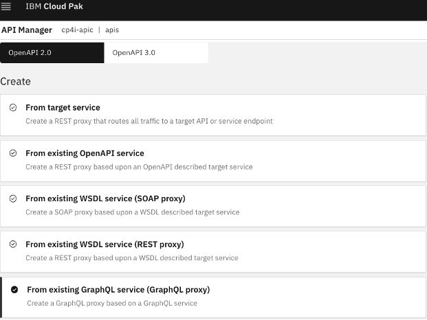

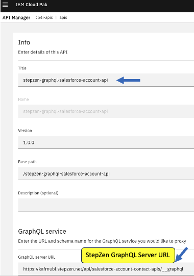

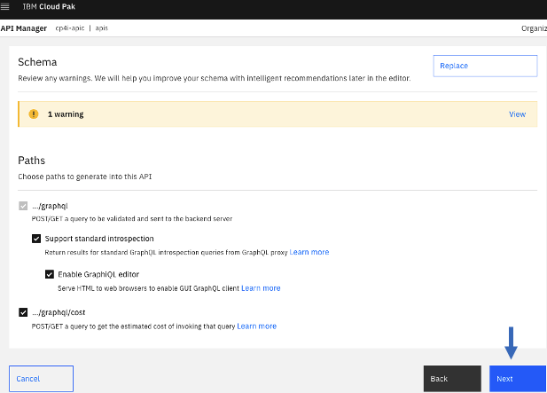


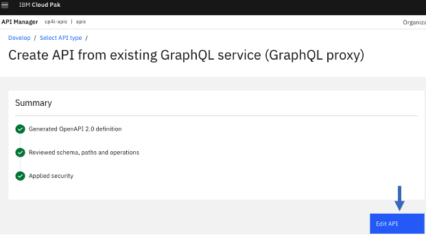


Uncheck Compression flag, from Gateway Tab > select graphql-invoke action (it will be in the middle of the flow).<br>
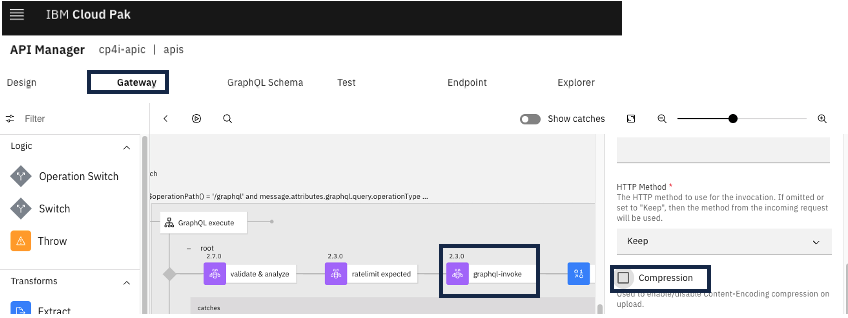


### 6.2 Testing the GraphQL API from ApiConnect Manager

Online the Api, and that will enable the "Test" tab. <br>

#### 6.2.1 Run getAccounts Query <br>
```
query getAccounts {
  getAccounts {
    Id
    AccountNumber
    Name
    AnnualRevenue
    BillingAddress {
      city
      country
      postalCode
      state
      street
    }
  }
}
```
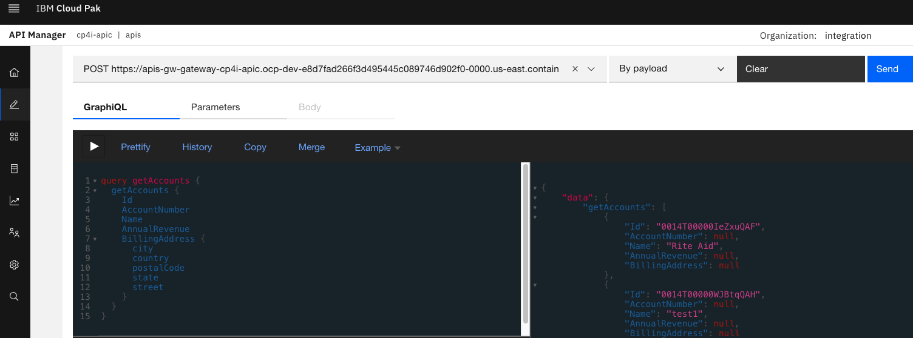

#### 6.2.2 Run getAccountById Query <br>
```
{
  getAccountById(id: "0014T0000048SQHQA2") {
    Id
    AccountNumber
    Name
    AnnualRevenue
    BillingAddress {
      city
      country
      postalCode
      state
      street
    }
  }
}

```
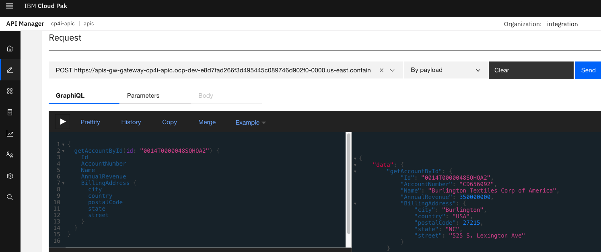

#### 6.2.3 Run both queries together
```
query MyQuery {
  getAccountById(id: "0014T0000048SQHQA2") {
    Id
    AccountNumber
    Name
    AnnualRevenue
    BillingAddress {
      city
      country
      postalCode
      state
      street
    }
  }
  getAccounts {
    Id
    AccountNumber
    Name
    AnnualRevenue
    BillingAddress {
      city
      country
      postalCode
      state
      street
    }
  }
}
```

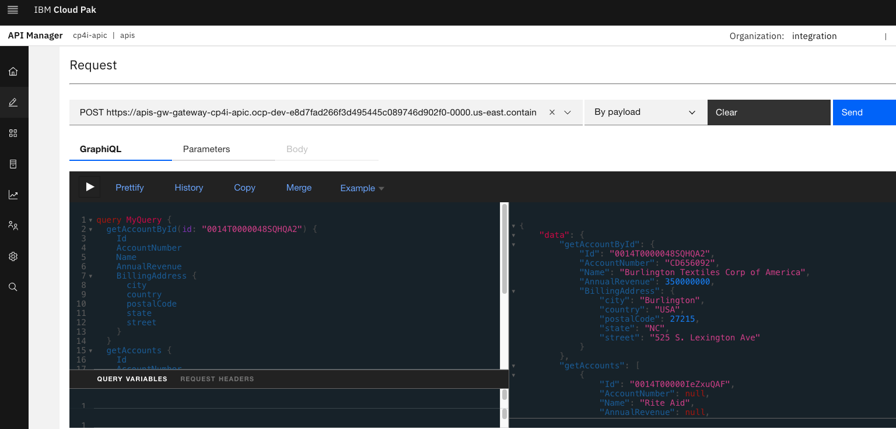


<br>
<br>
<br>


### Congratulations!!!
You have successfully created a API Connect GraphQL GraphQL Proxy in Api Connect!!!