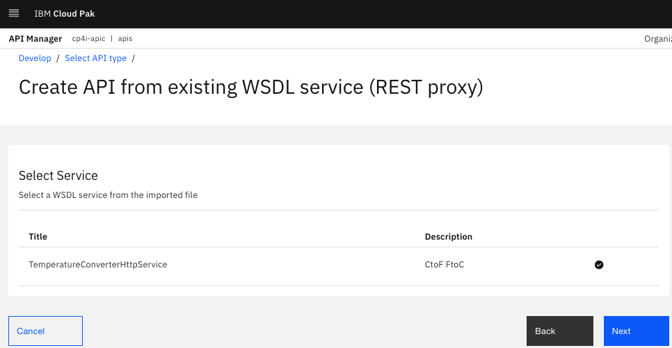

# Creating REST Proxy based upon a WSDL

# 1. Overview

In this lab, you will expose a SOAP WebService as a REST Proxy in API Connect. You will be deploying a very simple Temperature Converter WebService.  The WebService is built on App Connect, and the bar file will be deployed to App Connect running on Cloud Pak for Integration.<br>

<b> Design diagram </b>
<br>

<br>

# 2. App Connect - Deploy Temperature Converter WebService

Download the bar file from [<b><u>here</u></b>](./src/TemperatureConverter.bar).

Deploy the bar file.<br>

Logon to Cloud Pak for Integration Platform Navigator, open App Connect Dashboard > Click on "Deploy Integrations" tile.<br>


Select "Quick Start Integration", and Click \<Next\>. <br>

Drag & drop the bar file downloaded above as below.<br>


Click \<Next\> two times. <br>

Name your Integration Runtime as \"ace-tk-temperature-converter\". <br>


Click \<Create\>. <br>

Wait for 30seconds and refresh the page. <br>

Make sure the Integration Runtime \"ace-tk-temperature-converter\" is Ready. <br>

Click on the Integration Runtime \"ace-tk-temperature-converter\" tile.<br>


Click on the Properties tab, and copy "SOAP HTTP URL". This will be configured in the next section (API Creation).<br>


# 3. Api Connect - Create REST Proxy from the WSDL

Download the zip file that contains Temperature Converter WSDL, and XSD's from [<b><u>here</u></b>](./src/TemperatureConverter_WSDL.zip).

Logon to Cloud Pak for Integration, and open API Management (apim-demo). <br>

Select "Develop APIs and Products" tile.<br>


Click on "Add" > API button on the top right of the screen.<br>


Select the API Type "From Existing WSDL Service (REST Proxy). <br>

Click \<Next\> in the bottom right of of the screen. <br>

Drag and drop the zip file downloaded above.<br>


Click \<Next\> in the bottom right of of the screen. <br>



Click \<Next\> in the bottom right of of the screen. <br>


Change the API name as studentxx-temperature-converter-rest-api


Click \<Next\> in the bottom right of of the screen. <br>


Click \<Next\> in the bottom right of of the screen. <br>


Click \<Edit API\> in the bottom right of of the screen. <br>


Click on "Host", and blank out the value. <br>


Click on "Gateway" Tab. <br>


Watch how the API is orchestrated with parse, mapping, and Invoke nodes. Ciick on each node and see details (Example below).<br>


<br>
Now, complete the API design. <br><br>

Click on "Properties" on the left, and click (+) sign. Add target-url property, and paste "SOAP HTTP URL" captured in the previous seciton as below. <br>


Click \<Create\>. <br>

Now, click on "Policies" option on the left, and lets modify the API in the designer view.<br>

Click on each Node on the API Designer, see how the mapping is configured between REST to WSDL format. <br>
<br>
Now click on the first "CtoF Invoke" Node, and update the URL. <br>


Update URL value to "{target-url}" (without the double quotes). <br>

Similary, set the URL field on the other three Invoke Nodes to be same "{target-url}".<br>

SAVE the API (The Save button is on the top right of the screen). <br>

<br>

# 4. Testing the REST Proxy
Click on the "Test" tab.<br>


Click on "Test Configuration". <br>


Enable Auto-publish, and click "Save Preferences".<br>


Now, the API should be online.<br>


Select GET CtoF operation. <br>
Click "**Clear**" to display the Parameters.<br>


Enter 45 for TemperatureInC parameter below.<br>


You should get the response with the Converted Fahrenheit value as below.<br>


Check the "trace" tab of each Node as below.<br>


Also, check "trace" for each of the remaining nodes. <br>

**Optional test:** You can also try POST CtoF operation and enter below in the Body tab. <br>
```
{
    "TemperatureInC": 30
}
```
<br><br><br>

**Similary, test FtoC method.**
<br>
```
Enter sample JSON in the Body.
{
    "TemperatureInF": 32
}
```
### Congratulations!!!


