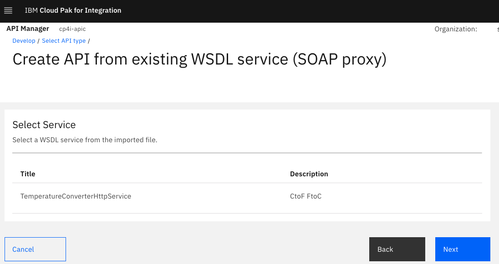
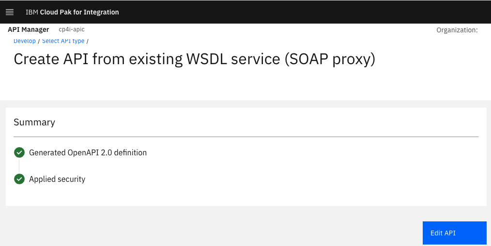
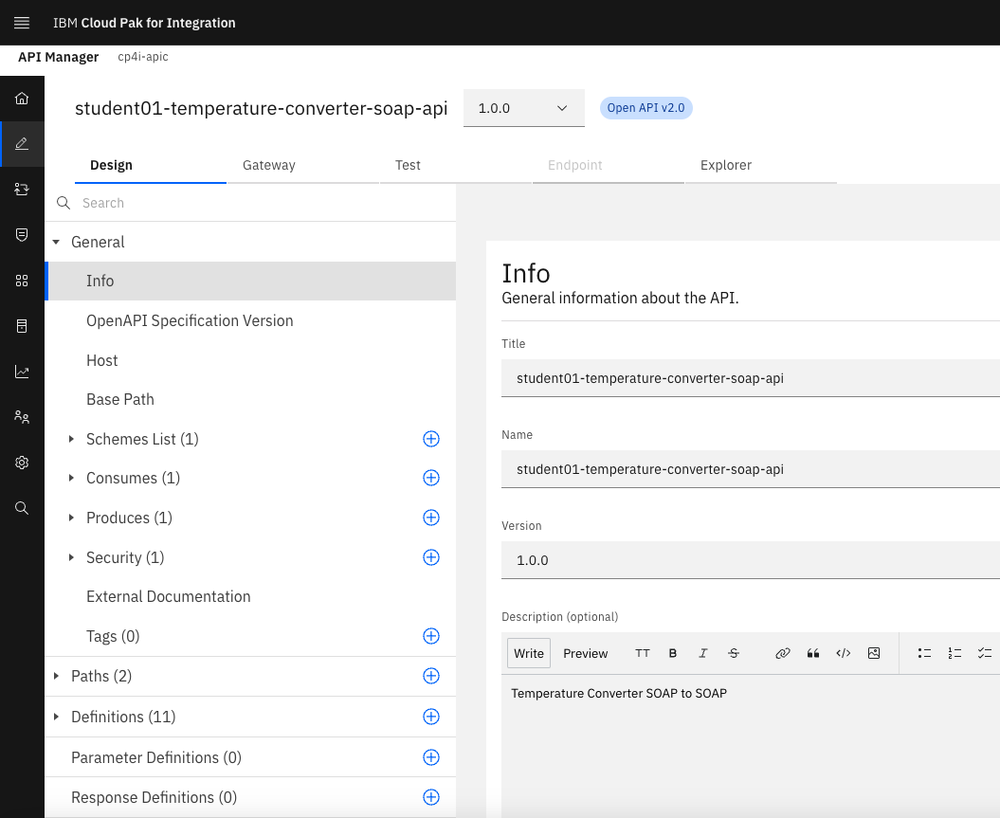

# Creating SOAP Proxy based upon a WSDL

# 1. Overview

In this lab, you will expose a SOAP WebService as SOAP Proxy in API Connect. You will be deploying a very simple Temperature Converter WebService.  The Temperature Converter WebService is built on App Connect Enterprise Toolkit, and the bar file will be deployed to App Connect Dashboard on Cloud Pak for Integration.<br>

<b> Design diagram </b>
<br>

<br>

# 2. App Connect - Deploy Temperature Converter WebService

<b>Download the bar file from [<b><u>HERE</u></b>](./src/TemperatureConverter.bar).
</b>

Deploy the bar file.<br>

Logon to Cloud Pak for Integration Platform Navigator, open App Connect Dashboard > Click on "Deploy Integrations" tile.<br>


Select "Quick Start Integration", and Click \<Next\>. <br>

Drag & drop the bar file downloaded above as below.<br>


Click \<Next\> two times. <br>

Name your Integration Runtime as \"ace-tk-temperature-converter\". <br>


Click \<Create\>. <br>

Wait for 30seconds and refresh the page. <br>

Make sure the Integration Runtime \"ace-tk-temperature-converter\" is Ready. <br>

Click on the Integration Runtime \"ace-tk-temperature-converter\" tile.<br>


Click on the Properties tab, and copy "SOAP HTTP URL". This will be configured in the next section (API Creation).<br>


# 3. Api Connect - Create SOAP Proxy from the WSDL

Download the zip file that contains Temperature Converter WSDL, and XSD's from [<b><u>here</u></b>](./src/TemperatureConverter_WSDL.zip).

Logon to Cloud Pak for Integration, and open API Management (apim-demo). <br>

Select "Develop APIs and Products" tile.<br>


Click on "Add" > API button on the top right of the screen.<br>


Select the API Type "From Existing WSDL Service (SOAP Proxy). <br>

Click \<Next\> in the bottom right of of the screen. <br>

Drag and drop the zip file downloaded above.<br>


Click \<Next\> in the bottom right of of the screen. <br>



Click \<Next\> in the bottom right of of the screen. <br>


Change the API name as studentxx-temperature-converter-soap-api
<br>


Click \<Next\> in the bottom right of of the screen. <br>


Click \<Next\> in the bottom right of of the screen. <br>




Click \<Edit API\> in the bottom right of of the screen. <br>



Click on "Host", and blank out the value. <br>


Click on "Gateway" Tab. <br>


Close the Node pallete.<br>

<br>
Now, complete the API design. <br><br>

Click on "Properties" on the left, and click (+) sign. Add target-url property, and paste "SOAP HTTP URL" captured in the previous section as below. <br>


Click \<Create\>. <br>

Now, click on "Policies" option on the left, and lets modify the API in the designer view.<br>

<br>
Now click on the  "Invoke" Node, and update the URL. <br>


Update URL value to "{target-url}" (without the double quotes). <br>

SAVE the API (The Save button is on the top right of the screen). <br>

<br>

# 4. Testing the SOAP Proxy

Click on the "Test" tab.<br>


Click on "Test Configuration". <br>


Enable Auto-publish, and click "Save Preferences".<br>


Now, the API should be online.<br>


Select POST and CtoF operation. <br>


Enter sample SOAP input payload in the Body Tab, and hit the <Send> button.<br>

```
<soapenv:Envelope xmlns:soapenv="http://schemas.xmlsoap.org/soap/envelope/" xmlns:tem="http://TemperatureConverter">
   <soapenv:Body>
      <tem:CtoF>
         <TemperatureInC>0</TemperatureInC>
      </tem:CtoF>
   </soapenv:Body>
</soapenv:Envelope>
```

You should get the response with the Converted Fahrenheit value as below.<br>


Check the "trace", and you should see as below.<br>


Similary, test FtoC method.<br>
```
<soapenv:Envelope xmlns:soapenv="http://schemas.xmlsoap.org/soap/envelope/" xmlns:tem="http://TemperatureConverter">
   <soapenv:Body>
      <tem:FtoC>
         <TemperatureInF>32</TemperatureInF>
      </tem:FtoC>
   </soapenv:Body>
</soapenv:Envelope>
```


You should get a response as below, converted temperature from Farenheit to Centigrade.<br>


### Congratulations!!!


