# API Connect - Test API's

# 1. Overview

In this lab, you will explore "Test APIs" capability of IBM API Connect to generate tests automatically. By using IBM Api Connect TestAPIs capability you can deliver high quality APIs consistently and improve developer productivity with automation and AI powered testing capabilities.
 
Reference: https://www.ibm.com/products/api-connect/api-testing

 
You will be using Customer Database Rest API deployed in lab xyz to explore Test APIs capability of IBM API Connect.  

 

# 2. App Connect - Deploy Customer Database Rest API

lab xxx to deploy the customer database bar file into App Connect.

# 3. Api Connect - Test APIs

From the Cloud Pak for Integration Platform Navigator, open API Connect Manager (apim-demo).  

Click on the "Test APIs" tile.  

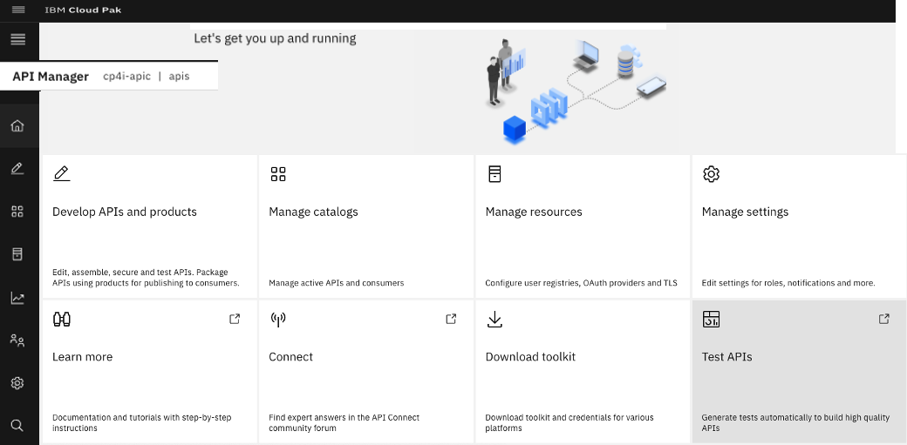

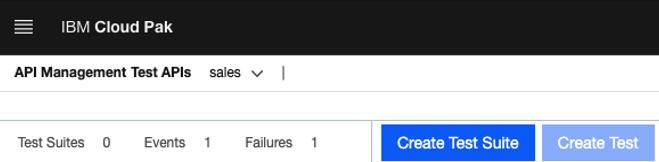
Click on "create a test suite".  

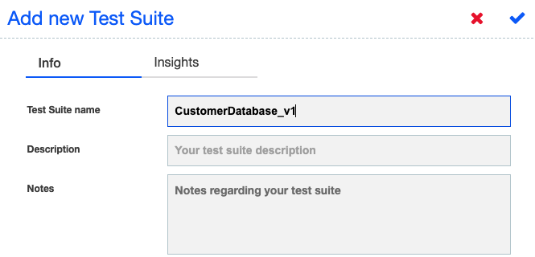

Click correct tick mark (on top right). 

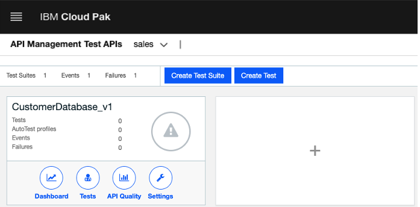

Click on "Tests" Option. 

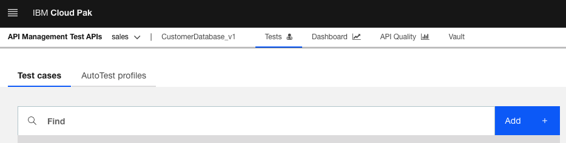
Click on \<Add\> to add a test.  

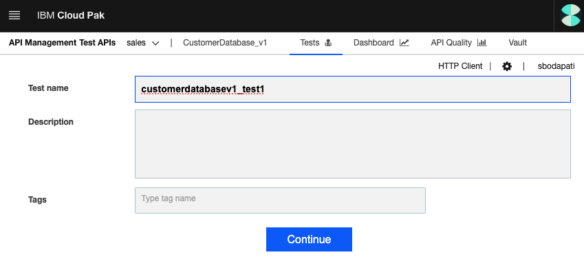
Enter customerdatabasev1_test1 and hit continue. 

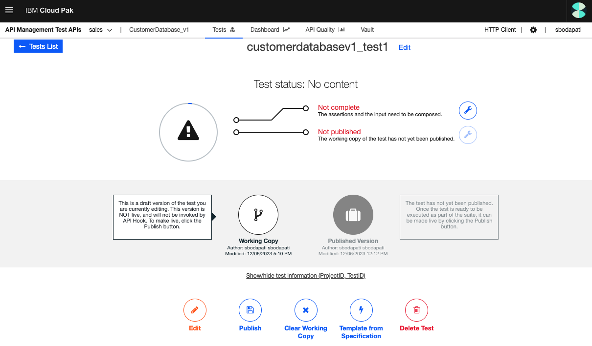
Click \<Edit\> in the bottom left. 

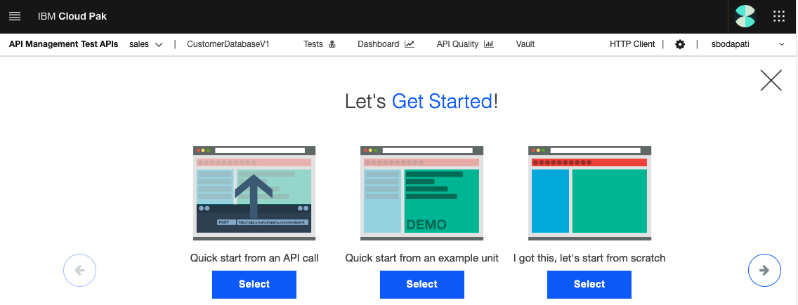
Select the first tile "Quick start from an API Call".  

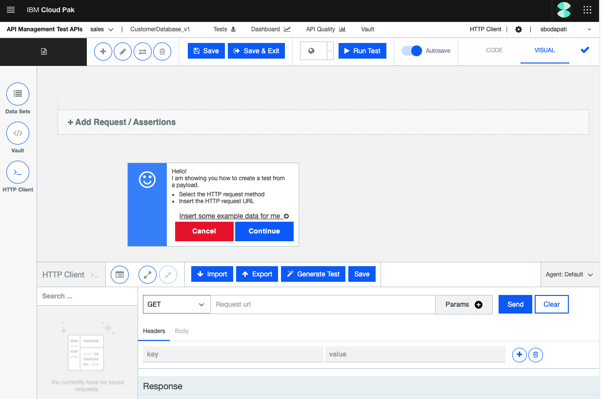

Open App Connect Dashboard, and copy the URL for postCustomers method as below. 
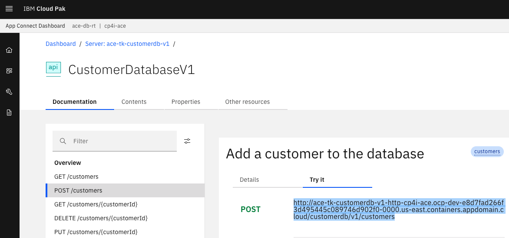

Switch back to API Connect Test API's, select POST method, paste the URL as below. 

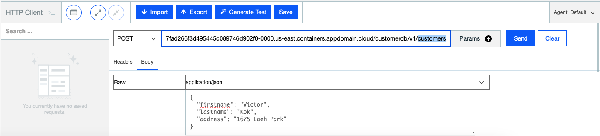

'''
In the body, set Raw & "application/json".
{
  "firstname": "Victor",
  "lastname": "Kok",
  "address": "1675 Laeh Park"
}
'''
Try the request by hitting \<Send\>.  

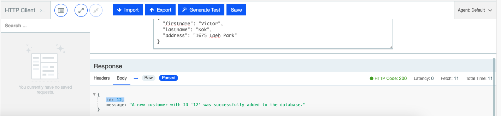

Hit \<Generate Test\>, this will generate the testcase, and assertions. 

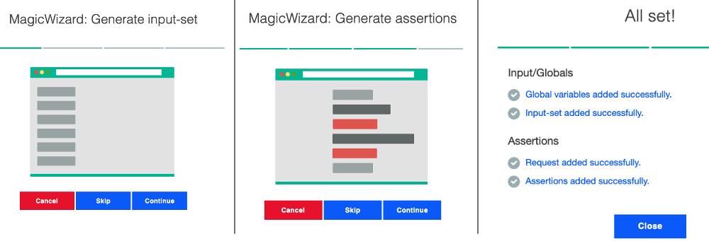

Click \<close\>.  

That should a testcase, and assertions for you.  

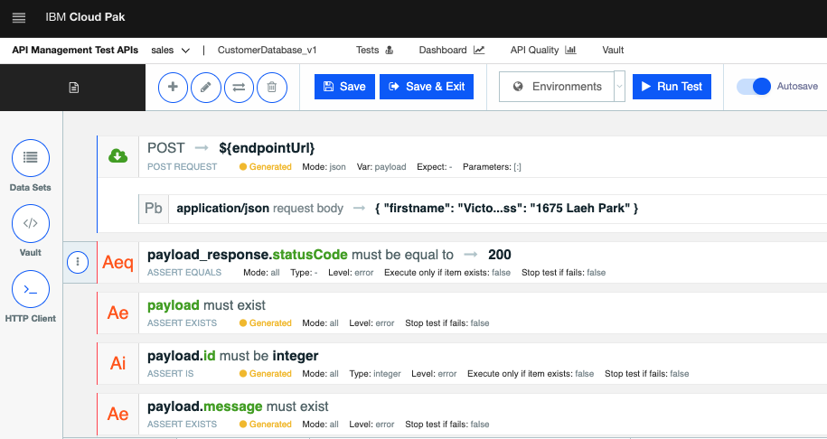

Lets add more testcases getcustomerbyid, deletecustomerbyid operations. 

Hit the plus sign on the top left as in below. 
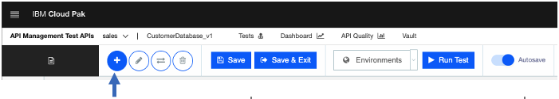

Add a Variable first. 
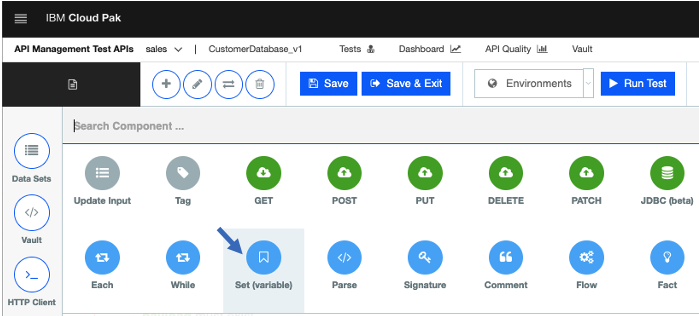

Name the variable as customer_id, and value to be ${payload.id}. 

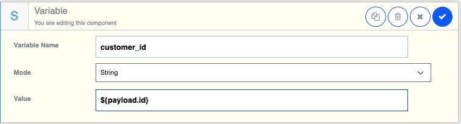

Hit the plus sign on the top left as in below. 

Select GET operation.  

Back to App Connect Dashboard, and capture URL for "GET /customers/{customerId}". 
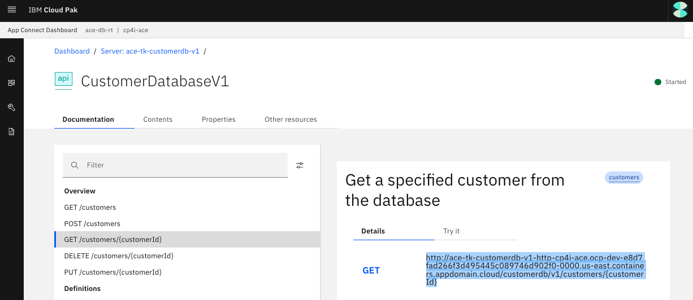

Switch back to API Connect Test API's, and paste the URL.
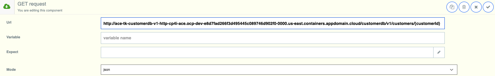

## TO BE CONTINUE