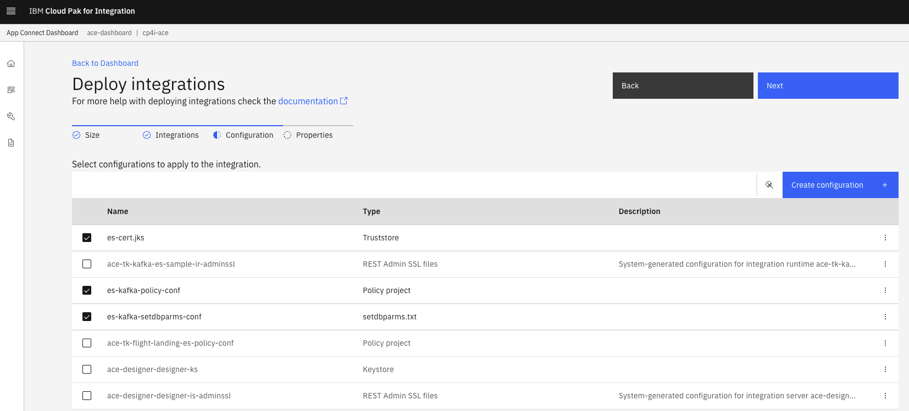
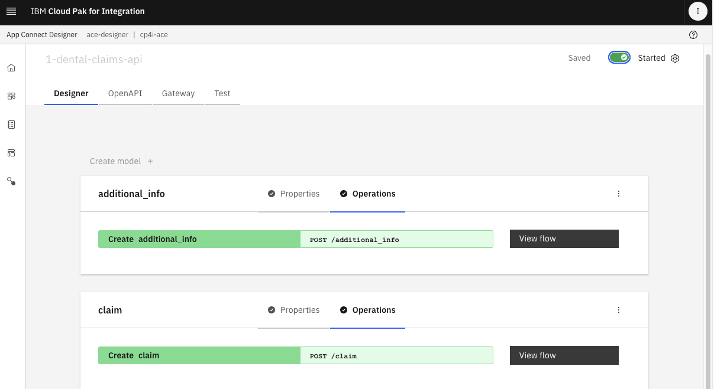
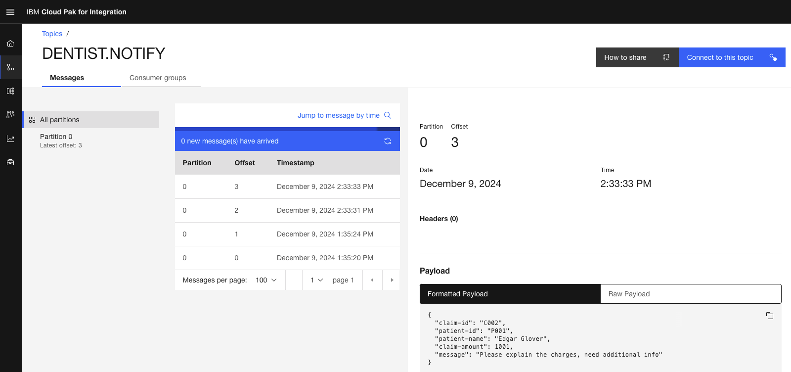

# Dental Insurance Claims Processing

---

# Table of Contents
- [1. Overview](#overview)
- [2. Business Scenario](#usecase)
- [3. Architecture Diagram](#diagram)
- [4. Implementation](#development)
  * [4a. App Connect Designer Flow](#ace-designer)
  * [4b. App Connect Dashboard](#ace-dashboard)
  * [4c. Event Endpoint Management](#eem)
  * [4d. Event Processing - Correlate Claims with Additional Claim Info Topics](#ep-correlate-topics)
- [5. Testing - Submit Claim through API](#testing)
  * [5a. Submit small Claim](#testing-small-claim)
  * [5b. Submit large Claim](#testing-large-claim)  
- [6. Testing - Event Processing](#testing-correlation)
---

## 1. Overview <a name="overview"></a>

This is a simple multi-style integration usecase for processing insurance claims submitted by dentist(s). Will be leveraging IBM Cloud Pak for Integration components App Connect Designer, App Connect Toolkit, Event Streams, Event Endpoiont Management, and Event Processing.
<br>

<br>


## 2. Business Scenario <a name="usecase"></a>

Note: Not implementing the entire usecase scenario. <br>

Scenario: <br>
A patient visits a dentist for a procedure that is covered 100% by Dental insurance. <br>

Events needs to be generated in this order below: <br>

(1) Dentist submits a claim for the procedure(s) to the Insurance Provider<br>
App Connect Designer Flow<br>
*** An event should be generated: "Claim received from dentist."<br>
*** Dental relationship app notifies the dentist that the claim was received.<br>
*** Auditing app logs event. NOT IMPLEMENTING THIS <br> 

(2) App Connect Toolkit Flow<br>
*** Claims processor processes the claim from the dentist and determines that additional information is needed from the dentist<br>
*** If additional information is needed, then an event will be generated asking for Additional information is needed from the dentist.<br>

(3) App Connect Designer Flow<br>
*** Dentist submits additional information as requested by the insurance provider<br>
*** Guardian dental relationship app gets the event and notifies the dentist that the additional was received.<br>

(4) Event Processing Flow<br>
*** Upon receiving additional info, Claims processor processes the claim from the dentist and initiates a payment to the dentist:<br>
*** Event generated: Payment to dentist is initiated.<br>
*** Dental relationship app gets the event and notifies the dentist that the claim is being paid.
<br>


## 3. Architecture diagram <a name="diagram"></a>


## 4. Implementation <a name="development"></a>


### 4a. App Connect Designer Flow <a name="ace-designer"></a>

Download the **ace-designer-dental-claims-api.yaml** <br>
    Click - [here](./src/ace-designer-dental-claims-api.yaml)

Import ace-designer-dental-claims-api.yaml into App Connect Designer. <br>


Review the flow. <br>

Start the API.<br>


### 4b. App Connect Dashboard <a name="ace-dashboard"></a>

The below flow is developed in App Connect Toolkit. <br>


Let's deploy the bar file into App Connect Dashboard. <br>

Download the **ace-tk-dental-claims-processing.bar** <br>
    Click - [here](./src/ace-tk-dental-claims-processing.bar)

<br>





<br>

**Note:** Deploying configurations es-cert.jks,es-kafka-policy-conf,es-kafka-setdbparms-conf are out-of-scope. see other event streaming labs.<br>
<br>
<br>


### 4c. Event Endpoint Management (EEM) <a name="eem"></a>

Logon to EEM UI. <br>

#### 4c.1 Add Consumer Topics <a name="eem-add-consumer-topics"></a>
From the "Manage Topics" view, click on "Add topic". <br>

Click "Consume Events" tile, and click \<Next\>.

Select the cluster es-demo. <br>
Note: Add a new cluster if es-demo isn't already added. <br>

Select the topics. <br>


<br>


#### 4c.2 Add Producer Topics <a name="eem-add-producer-topics"></a>


<br>


#### 4c.3 Describe DENTIST.ADDITIONAL_INFO Topic <a name="eem-describe-topics"></a>

From the Topics view, click on DENTIST.ADDITIONAL_INF Topic. <br>

Click on "Edit Information". <br>


Paste the below sample message. <br>

```
{
  "claim-id": "C002",
  "patient-id": "P002",
  "patient-name": "Rick Clemento",
  "claim-amount": 2000,
  "additional-info": "Patient needed extra care, spent an extra 45minutes, hence the additional charges."
}
```

Click on "Options" tab. <br>


Click \<Next\>.<br>

Click on \<Publish\>. <br>


#### 4c.4 REPEAT the above for the other two topics DENTIST.CLAIMS and DENTIST.PAYMENT Topics. <br>

For DENTIST.CLAIMS copy/paste the below Sample Message. <br>

```
{
  "claim-id": "C001",
  "patient-id": "P001",
  "patient-name": "Edgar Glover",
  "date-of-birth": "1/10/1959",
  "service-date": "11/02/2024",
  "claim-amount": 100,
  "procedure-codes": "C100",
  "dentist-name": "Chester Jackson"
}
```

For DENTIST.PAYMENT copy/paste the below Sample Message. <br>
```
{
  "claim-id": "C001",
  "patient-id": "P003",
  "patient-name": "Linda Jodl",
  "date-of-birth": "2/20/1989",
  "service-date": "11/07/2024",
  "claim-amount": 200,
  "procedure-codes": "D100",
  "dentist-name": "Joe Jodl",
  "message": "Ready for payment"
}
```
<br>


### 4c.5 Generate Access Credentials <a name="generate-credentials"></a>

Click on the Catalog View, and select DENTIST.ADDITIONAL_INFO topic. <br>

>

Clock "Generate access credentials" \. <br>


Save the credentials into a Notepad. <br>


Similarly, "Generate access credentials" for the DENTIST.CLAIMS, and DENTIST.PAYMENT topics. <br>

<br><br>


### 4d. Event Processing - Correlate Claims with Additional Claim Info Topics <a name="ep-correlate-topics"></a>

Download the **ep-dental-claims-additional-info-processing.json** <br>
    Click - [here](./src/ep-dental-claims-additional-info-processing.json)


Open Event Processing UI, and import ep-dental-claims-additional-info-processing.json flow. <br>


Review the flow. <br>

Update Access Credentials.<br>


Enter JSON Sample message. <br>
```
{
  "claim-id": "C002",
  "patient-id": "P001",
  "patient-name": "Edgar Glover",
  "date-of-birth": "1/10/1959",
  "service-date": "11/02/2024",
  "claim-amount": 1001,
  "procedure-codes": "C105, D200, E201",
  "dentist-name": "Chester Jackson"
}
```


Similarly, update DENTIST.ADDITIONAL_INFO topic with the credentials you captured.<br>
Add for JSON Sample message enter the below.<br>

```
{
  "claim-id": "C002",
  "patient-id": "P001",
  "patient-name": "Edgar Glover",
  "claim-amount": 1001,
  "additional-info": "Patient needed extra care, spent an extra 30 minutes, hence the additional charges."
}
```


<br>


## 5. Testing - Submitting Claim through API<a name="testing"></a>

Go back to the App Connect Designer. <br> 

Start the flow if not already started. <br>



Click on the Test tab. <br>


Click on /claims operation, and click on "Try it". <br>


### 5a. Submit small Claim <a name="testing-small-claim"></a>

Paste the below Claim (JSON payload) in Designer view above. <br>
```
{
    "claim-id": "C001",
    "patient-id": "P001",
    "patient-name": "Edgar Glover",
    "date-of-birth": "1/10/1959",
    "service-date": "11/02/2024",
    "claim-amount": "100.00",
    "procedure-codes": "C100",
    "dentist-name": "Chester Jackson"
}
```


Hit Send button. You should get a response like below.<br>


A Claim event should be created in Kafka Topic DENTIST.CLAIMS. <br>


Two notification events should also be created in Kafka Topic DENTIST.NOTIFY. <br>


<br><br>

### 5b. Submit large Claim <a name="testing-large-claim"></a>

Lets send a large claim which has claim-amount greater than $1000. This should generate a notification to the dentist asking for additional info for explanation of the charges.
<br>

From the App Connect Designer, send the below Claim.<br>

```
{
    "claim-id": "C002",
    "patient-id": "P001",
    "patient-name": "Edgar Glover",
    "date-of-birth": "1/10/1959",
    "service-date": "11/02/2024",
    "claim-amount": "1001.00",
    "procedure-codes": "C105, D200, E201",
    "dentist-name": "Chester Jackson"
}
```


Check in Kafka, <br>




<br>

Now, lets send additional info about the claim explaing the large amount being charged. From the App Connect Designer click on /additional_info operation.<br>

App Connect Designer > select /additional_info operation. <br>


Paste the below JSON into the Body field. <br>

```
{
    "claim-id": "C002",
    "patient-id": "P001",
    "patient-name": "Edgar Glover",
    "claim-amount": 1001,
    "additional-info": "Patient needed extra care, spent an extra 30 minutes, hence the additional charges."
}
```

Check Event Streams Console, check DENTIST.ADDITIONAL_INFO topic for additional_info record. <br>


Also, check DENTIST.NOTIFY topic for informational event (below).<br>


<br><br>

## 6. Testing - Event Processing <a name="testing-correlation"></a>

Go back to the Event Processing Console. <br>


Click on Run Flow > include historical. The flow is essentially, joining DENTIST.CLAIMS, and DENTIST.ADDITIONAL_INFO topics with claim_id, and patient_id. Upon matching, it's generating a payment event.<br>

You should see the output as below. <br>

 

Check Kafka console, and you should see a payment record in DENTIST.PAYMENT topic.
<br>


also, you should see notification records in DENTIST.NOTIFY topic. <br>


## End 
