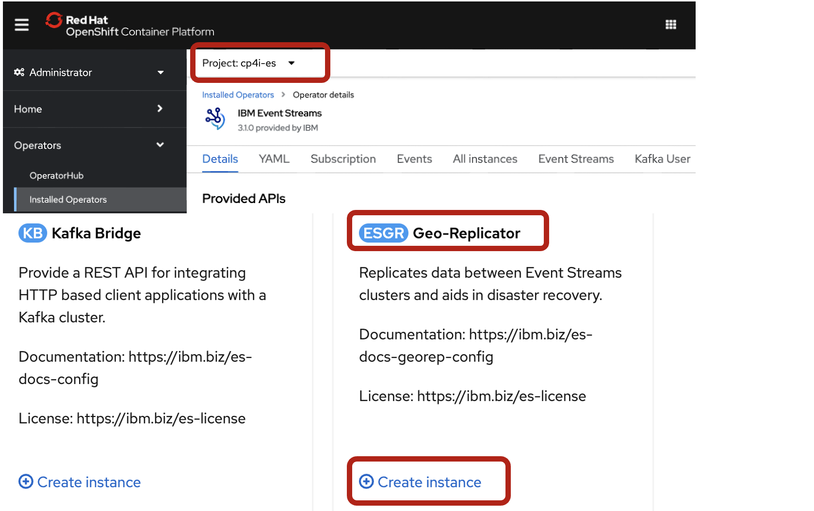
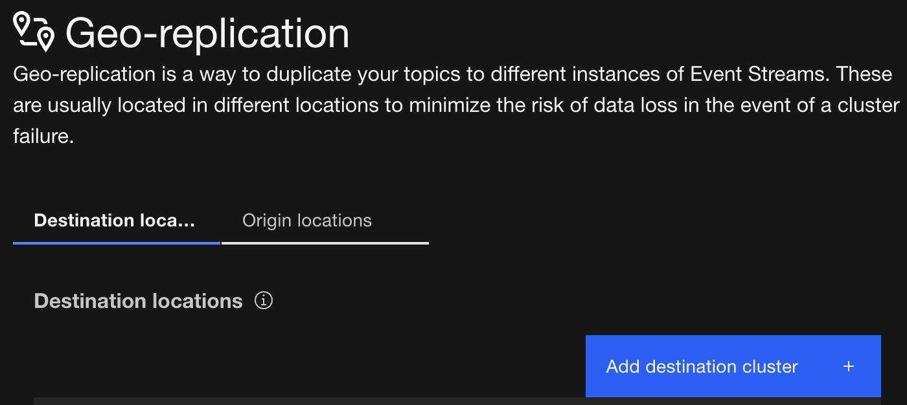
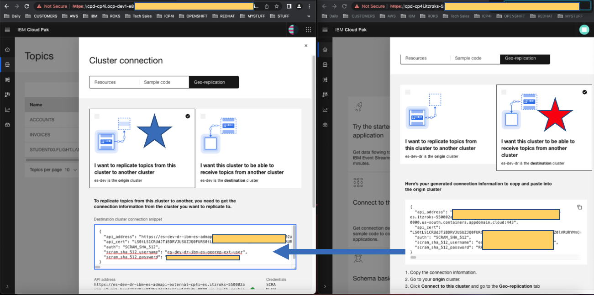
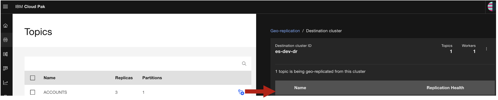
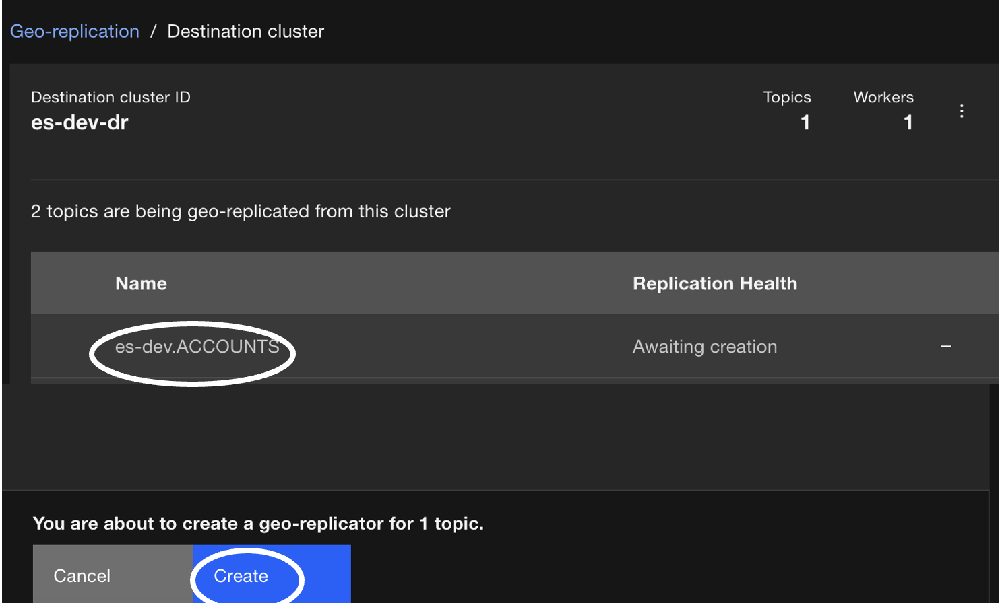
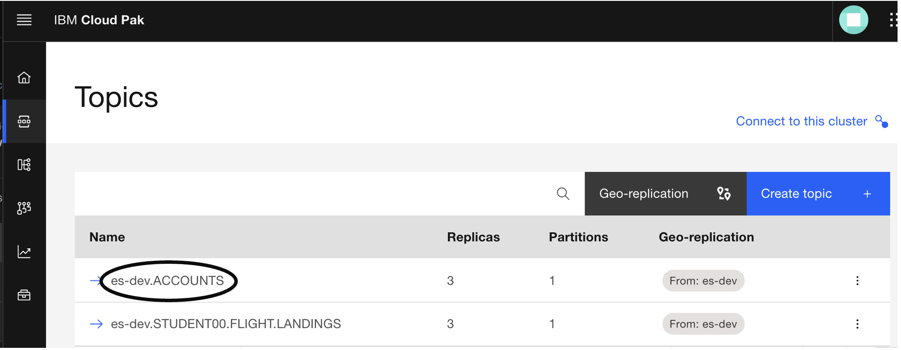
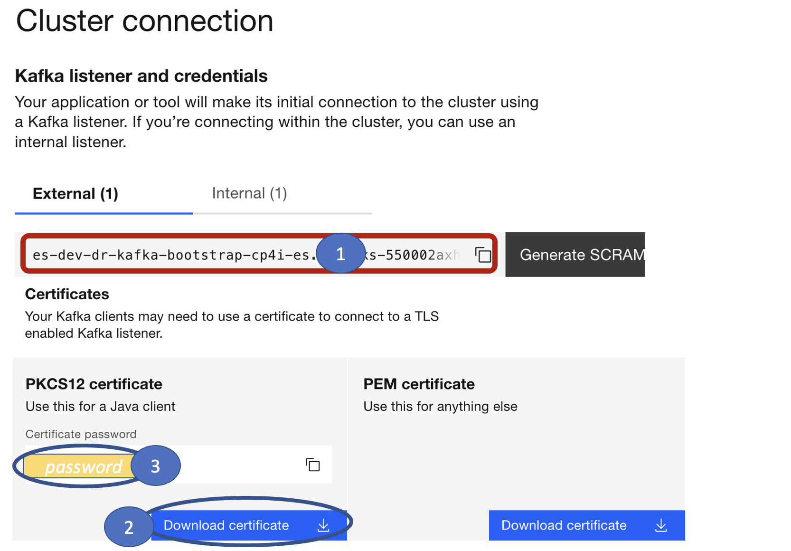
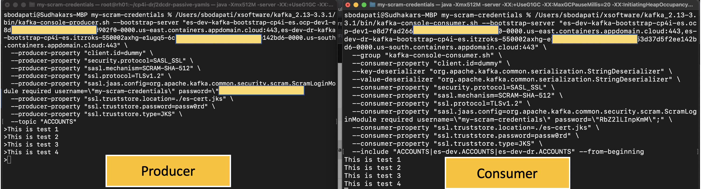

# IBM Event Streams - Geo Replication Setup & Testing

## 1. Overview

Geo-Replication helps with Disaster Recovery, the feature creates copies of selected Topics and it's data from the source Event Streams Cluster to the destination Event Streams Cluster. Geo-Replication will be configured between two IBM Event Streams Clusters that are running on different OpenShift Clusters. <br>

This basic lab, guides you through setting up Geo-Replication in IBM Event STreams, and perform simple tests using kafka client's kafka-console-producer.sh, and kafka-console-consumer.sh programs. 
<br>


## 2.Environment

a) Two OpenShift Clusters<br>
b) Namespace cp4i-es (same namespace on both ocp clusters). <br>
c) An IBM Event Strans instance on each cluster (es-dev, es-dev-dr).<br>

The lab environment is pre-installed with es-dev and es-dev-dr Event Streams instances. Assuming that es-dev is the Primary instance, and es-dev-dr will be the Disaster Recovery instance. <br>


### Create EventStreamsGeoReplicator Instance / the Operand

Create Create EventStreamsGeoReplicator instance if it's not already created. 

a) Login to the Primary OpenShift Cluster <br>
b) Navigate to Operator Hub > Installed Operators > Change Project to cp4i-es (namespace where es-dev is installed) > Select IBM Event Streams Operator. <br>
c) Select Geo Replicator Tile as below <br>




```
apiVersion: eventstreams.ibm.com/v1beta1
kind: EventStreamsGeoReplicator
metadata:
  labels:
    eventstreams.ibm.com/cluster: es-dev
  name: es-dev
  namespace: cp4i-es
```

Make sure the "name", "eventstreams.ibm.com/clusters" is set to the eventstreams instance name (es-dev).<br>

Login to the Disaster Recovery OpenShift Cluster, and REPEAT the above steps. <br><br>


## 2. Security Setup

### KafkaUser
A KafkaUser with same id/password should be created on both the Event Streams Clusters.<br>

```
kind: Secret
apiVersion: v1
metadata:
  name: my-scram-credentials
type: Opaque
stringData:
  password: 'a_very_secure_password'
```

```
apiVersion: eventstreams.ibm.com/v1beta2
kind: KafkaUser
metadata:
  name: my-scram-credentials
  namespace: cp4i-es
  labels:
    eventstreams.ibm.com/cluster: es-dev
spec:
  authentication:
    type: scram-sha-512
  authorization:
    type: simple
    acls:
      - resource:
          type: topic
          name: '*'
          patternType: literal
        operation: Write
      - resource:
          type: topic
          name: '*'
          patternType: literal
        operation: Read
      - resource:
          type: topic
          name: '*'
          patternType: literal
        operation: Create
      - resource:
          type: group
          name: '*'
          patternType: literal
        operation: Read
      - resource:
          type: topic
          name: __schema_
          patternType: prefix
        operation: Read
      - resource:
          type: topic
          name: __schema_
          patternType: prefix
        operation: Alter
      - resource:
          type: transactionalId
          name: '*'
          patternType: literal
        operation: Write
```

Run the above two yaml's from your PRIMARY OpenShift Console.

REPEAT the same yaml's on the DISASTER recovery site, but make sure to change KafkaUser yaml's field as eventstreams.ibm.com/cluster: es-dev-dr.
<br>
<br>

## 3. Configuring Geo-Replication

### Create a Topic on the Primary Kafka Cluster

Open two browser windows, and Logon to Event Streams Consoles: <br><br>

a) On the Primary Kafka Cluster: create Topic (Example Topic ACCOUNTS).<BR>
b) Click "Geo Replication" as below <br>



Click <b> "Add Destination Cluster" <b> <br>

Repeat step b) on the DR Event Streams Console: <br> 

Copy Credentials from DR Kafka Cluster and Paste on the Primary Geo-Replication configuration as below:<br>


c) Connect Cluster button on the Active Cluster side (left) <br>

d) On the Primary Event Streams Console, Add ACCOUNTS topic to be replicated as below. <br>



Click "Create Button", and that will create geo-replication cluster linking.<br>



d) Check the DR cluster and verify the es-dev.ACCOUNTS topic is being replicated. <br>



## 4. Prepare for Testing

### 4.1 Download es-cert.p12 & Certificate Password 

on the Primary site:<br>
Logon to IBM Cloud Pak for Integration Platform Navigator, and open Event Streams instance.<br>
Click on "Connect to this Cluster" tile on the Home page.<br>



a) Copy BOOTSTRAP URL, Paste into Notepad.<br>
b) Download certificate, Save it the Downloads folder.<BR>
c) Rename es-cert.p12 to es-cert-es-dev.p12.<br>
d) Copy es-cert.p12 PASSWORD, Paste into Notepad.<br>

REPEAT the above steps on the DR Event Streams instance: <br>
a) Copy BOOTSTRAP URL, Paste into Notepad.<br>
b) Download certificate, Save it the Downloads folder
c) Rename es-cert.p12 to es-cert-es-dev-dr.p12.<br>
d) Copy es-cert.p12 PASSWORD, Paste into Notepad.<br>
<br>

The es-cert.p12 password will be used to create the JKS file which contains both kafka cluster certificates.<br>
<br>

### 4.2 es-cert,jks - Create a combined certificates JKS file

Create JKS file using Primary Certificate:<br>
keytool -importkeystore -srckeystore es-cert-es-dev.p12 -srcstoretype PKCS12 -destkeystore es-cert.jks -deststoretype JKS -srcstorepass <Notepad_Password_for_Primary> -deststorepass passw0rd -srcalias ca.crt -destalias es-cert-es-dev <br>

Add dr cert into es-cert.jks
Download p12 of dr event streams.
keytool -importkeystore -srckeystore es-cert-es-dev-dr.p12 -srcstoretype PKCS12 -destkeystore es-cert.jks -deststoretype JKS -srcstorepass <Notepad_Password_for_DR> -deststorepass passw0rd -srcalias ca.crt -destalias es-cert-es-dev-dr <br>
<br>


### 4.3 Apache Kafka Downloading

### Download Kafka 
https://kafka.apache.org/downloads

Download "Scala 2.13  - kafka_2.13-3.3.1.tgz (asc, sha512)" <br>
<br>
Unzip tgz file to Downloads folder.<br>
<br>


## 5. Testing 

### 5.1 Producing Messages w/kafka-console-producer.sh
```
/Users/REPLACE-USERNAME/Downloads/kafka_2.13-3.3.1/bin/kafka-console-producer.sh --bootstrap-server "bootstrap-url_1,bootstrap-url_2" \
  --producer-property "client.id=dummy" \
  --producer-property "security.protocol=SASL_SSL" \
  --producer-property "sasl.mechanism=SCRAM-SHA-512" \
  --producer-property "ssl.protocol=TLSv1.2" \
  --producer-property "sasl.jaas.config=org.apache.kafka.common.security.scram.ScramLoginModule required username=\"my-scram-credentials\" password=\"a_very_secure_password\";" \
  --producer-property "ssl.truststore.location=./es-cert.jks" \
  --producer-property "ssl.truststore.password=passw0rd" \
  --producer-property "ssl.truststore.type=JKS" \
  --topic "ACCOUNTS"
```
### 5.2 Consuming Messages w/kafka-console-consumer.sh
```
/Users/REPLACE-USERNAME/Downloads/kafka_2.13-3.3.1/bin/kafka-console-producer.sh --bootstrap-server "bootstrap-url_1,bootstrap-url_2" \
  --group "kafka-console-consumer.sh" \
  --consumer-property "client.id=dummy" \
  --key-deserializer "org.apache.kafka.common.serialization.StringDeserializer" \
  --value-deserializer "org.apache.kafka.common.serialization.StringDeserializer" \
  --consumer-property "security.protocol=SASL_SSL" \
  --consumer-property "sasl.mechanism=SCRAM-SHA-512" \
  --consumer-property "ssl.protocol=TLSv1.2" \
  --consumer-property "sasl.jaas.config=org.apache.kafka.common.security.scram.ScramLoginModule required username=\"my-scram-credentials\" password=\"a_very_secure_password\";" \
  --consumer-property "ssl.truststore.location=./es-cert.jks" \
  --consumer-property "ssl.truststore.password=passw0rd" \
  --consumer-property "ssl.truststore.type=JKS" \
  --include "ACCOUNTS|es-dev.ACCOUNTS"
```
<br>



### 5.2 Failover Testing

IN-PROGRESS <BR>

# References
About Geo-Replication <br>
https://ibm.github.io/event-streams/georeplication/about/

Planning your geo-replication<br>
https://ibm.github.io/event-streams/georeplication/planning/

Setting up Geo-Replication <br>
https://ibm.github.io/event-streams/georeplication/setting-up/

Consuming Messages <br>
https://ibm.github.io/event-streams/about/consuming-messages/

Switching Clusters<br>
https://ibm.github.io/event-streams/georeplication/failover/

# Troubleshooting
a) Error when creating GeoReplicator instance: An unexpected exception was encountered: Replicator Connect User secret es-dev-ibm-es-georep-user doesn't exist. More detail can be found in the Event Streams geo-replication operator LOGGER. <br>
Fix: IGNORE, the installation will resolve this automatically. <br>
