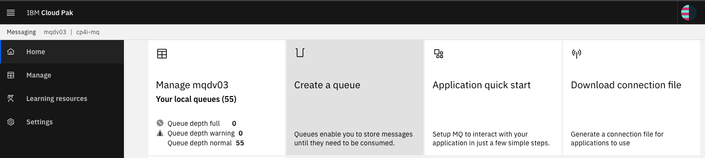
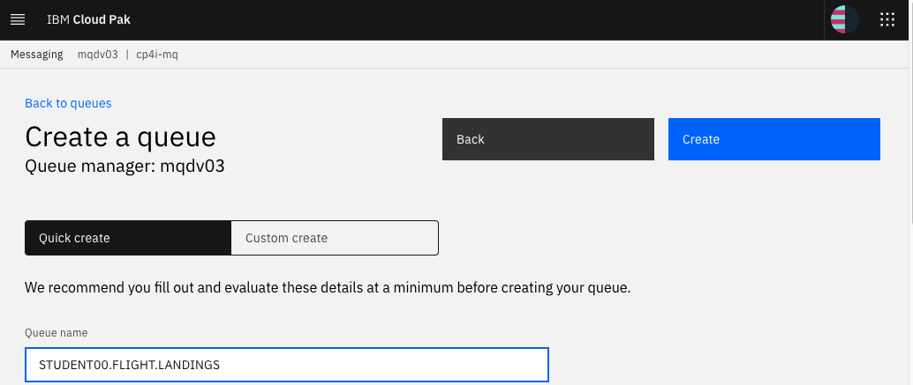
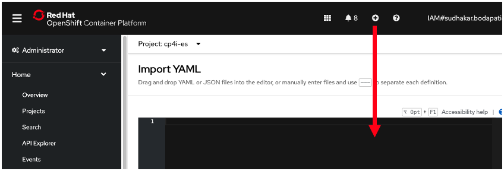
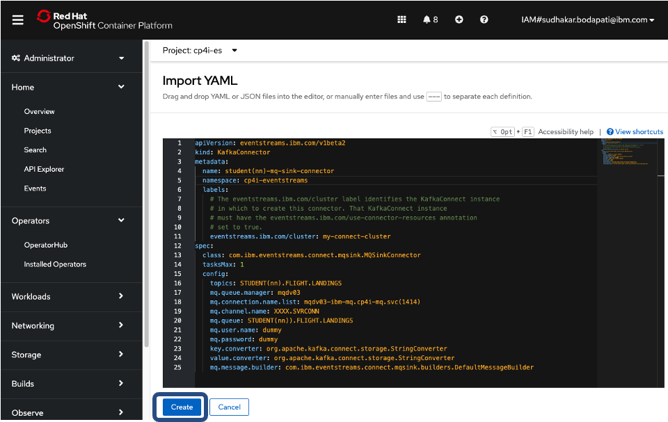
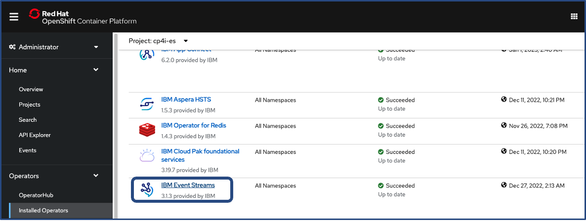
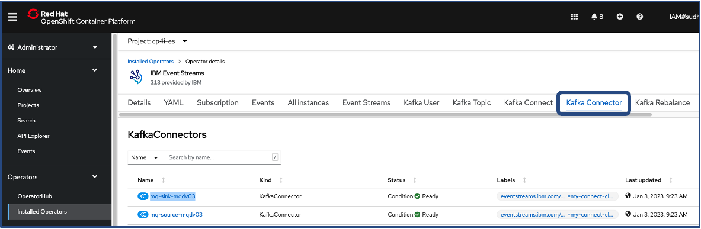
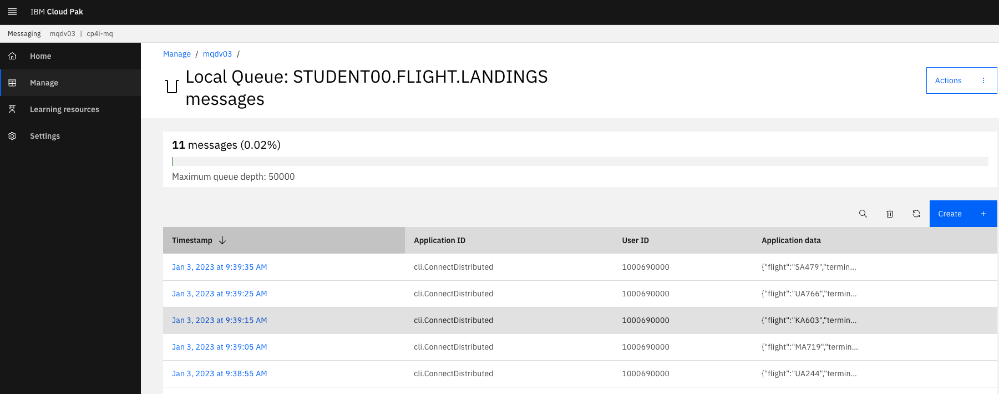

# IBM Event Streams - MQSink Kafka Connector

## 1. Overview

This lab will guide you how to build MQSINK Kafka Connector in IBM Event Streams to synchronize/copy Topic data from IBM Event Streams to IBM MQ Queue.

<br>


<br>

## 2. Create IBM MQ Queue - STUDENT(nn).FLIGHT.LANDINGS
From the Cloud Pak for Integration Console;<br>
a) Open MQ Console of your Queue Manager<br>
b) Create Queue STUDENT(nn).FLIGHT.LANDINGS





<br>
<br>

## 3. Create MQSINK Connector
In this section you will;<br>
a) Copy/paste the below yaml into OpenShift Console<br>
b) Update the yaml with your IBM Event Streams Topic name, and IBM MQ Queue name<br>
<br>
Logon to the OpenShift Console, and click on the Plus sign (Import Yaml). <br>



Copy/Paste the below KafkaConnector yaml, and update the configuration to match your student number.<br>

```
apiVersion: eventstreams.ibm.com/v1beta2
kind: KafkaConnector
metadata:
  name: student(nn)-mq-sink-connector
  namespace: cp4i-eventstreams
  labels:
    # The eventstreams.ibm.com/cluster label identifies the KafkaConnect instance
    # in which to create this connector. That KafkaConnect instance
    # must have the eventstreams.ibm.com/use-connector-resources annotation
    # set to true.
    eventstreams.ibm.com/cluster: my-connect-cluster
spec:
  class: com.ibm.eventstreams.connect.mqsink.MQSinkConnector
  tasksMax: 1
  config:
    topics: STUDENT(nn).FLIGHT.LANDINGS
    mq.queue.manager: <name-of-your-queue-manager>
    mq.connection.name.list: <name-of-your-queue-manager>-ibm-mq.cp4i-mq.svc(1414)
    mq.channel.name: XXXX.SVRCONN
    mq.queue: STUDENT(nn)).FLIGHT.LANDINGS
    mq.user.name: dummy
    mq.password: dummy
    key.converter: org.apache.kafka.connect.storage.StringConverter
    value.converter: org.apache.kafka.connect.storage.StringConverter
    mq.message.builder: com.ibm.eventstreams.connect.mqsink.builders.DefaultMessageBuilder
```

c) Apply the yaml to "create" Event Streams MQSINK Kafka Connector<br>


<br>
<br>

## 4. MQSINK Connector Readiness Check

From the OpenShift Console;<br>
a) Navigate to Operators > Installed Operators <br>
b) Change project to cp4i-eventstreams<br>
c) Click on "IBM Event Streams" Operator<br>



d) Click on "Kafka Connector" tab <br>


Make sure the student(nn)-mq-sink-connector is in Ready state<br>

<br><br>

## 5. Verify Topic to Queue Data Synchronization

From the Cloud Pak for Integration Console;<br>
a) Open MQ Console of your Queue Manager <br>
b) Click on the Manage Tile<br>
c) Click on STUDENT(nn).FLIGHT.LANDINGS Queue<br>



Verify the events from the Event Streams Topic STUDENT(nn).FLIGHT.LANDINGS are synchronized into Queue STUDENT(nn).FLIGHT.LANDINGS.<br>


<br><br><br>


### Congratulations !!!