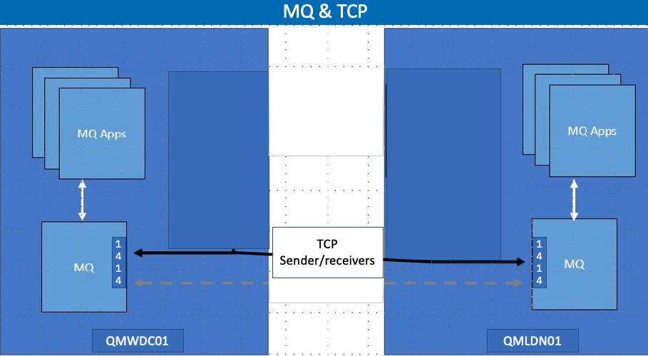
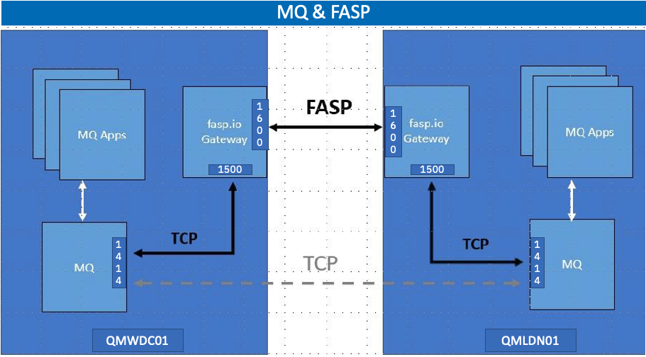

# IBM MQ Messaging & Aspera FASP.IO Gateway

## 1. Overview

The purpose of this lab to demonostrate the benefit of using Aspera fasp.io Gateway with IBM MQ over TCP.

At a high level, we will be using two VM's, one in Washington DC-United States, and another in London-United Kingdom.

You will be testing two usecases. 
<br>
a) Send large messages with MQ with TCP <br>
b) Send large messages with MQ with FASP over TCP
<br>
<br>

## 2. Setup

This is a pre-work for the IBM team. Please skip to Section 3. <br>

### 2.1 installing MQ on Linux

<b> a) Download MQ Linux v9.3.2 </b> <br>
<b> b) install as below </b> <br>

```
./mqlicense.sh

$ sudo vi /etc/sysctl.conf
    fs.file-max=524288
$ sudo sysctl -p

vi /etc/security/limits.conf	
mqm             hard    nproc           4096
mqm             soft    nproc           4096
mqm             hard    nofile          10240
mqm             soft    nofile          10240
$ sudo su -
$ echo 32768 > /proc/sys/kernel/threads-max

rpm -ivh MQSeriesServer-9.3.1-0.x86_64 MQSeriesFTService-9.3.1-0.x86_64 MQSeriesGSKit-9.3.1-0.x86_64 MQSeriesClient-9.3.1-0.x86_64 MQSeriesJRE-9.3.1-0.x86_64 MQSeriesFTAgent-9.3.1-0.x86_64 MQSeriesFTTools-9.3.1-0.x86_64 MQSeriesRuntime-9.3.1-0.x86_64 MQSeriesSamples-9.3.1-0.x86_64 MQSeriesJava-9.3.1-0.x86_64 MQSeriesFTBase-9.3.1-0.x86_64

```

<b> c) Download Aspera fasp.io gateway </b> <br>

Download fasp.io gateway from https://www.ibm.com/products/aspera/downloads <br>

install fasp.io package<br>
```
rpm -ivh ibm-faspio-gateway-1.3.0.30-1.x86_64.rpm
```
<br>

<b> d) Configure Aspera fasp.io license </b> <br>
vi /usr/local/etc/faspio/aspera-license <br>
Add fasp.io gateway license.
<br><br>


## 3. MQ Messaging with TCP Setup & Testing

Note: Please replace xx.xx.xx.xx with Washington IP Address, and yy.yy.yy.yy with London VM IP Address. <br>
<br>




<table>
    <thead>
      <tr>
        <th>WDC</th>
        <th>LDN</th>
      </tr>
    </thead>
    <tbody>
        <tr>
            <td>crtmqm QMWDCD01

strmqm QMWDCD01 

runmqsc QMWDCD01 

alter qmgr chlauth(disabled)

alter qmgr connauth(' ')

refresh security (*) 

def listener(listener.1414) trptype(tcp) port(1414) control(qmgr)

start listener(listener.1414)

dis lsstatus(listener.1414)

def chl(WDC.LDN) chltype(sdr) conname('yy.yy.yy.yy(1414)') XMITQ(XMITQ.QMLDND01)

def chl(LDN.WDC) chltype(rcvr)

DEF QLOCAL(XMITQ.QMLDND01) USAGE(XMITQ) INITQ(SYSTEM.CHANNEL.INITQ) TRIGDATA(WDC.LDN)

START CHL(WDC.LDN)

Dis chstatus(WDC.LDN)
</td>
            <td>crtmqm QMLDND01

strmqm QMLDND01 

runmqsc QMLDND01

alter qmgr chlauth(disabled)

alter qmgr connauth(' ')

refresh security (*) 

def listener(listener.1414) trptype(tcp) port(1414) control(qmgr)

start listener(listener.1414)

dis lsstatus(listener.1414)

def chl(LDN.WDC) chltype(sdr) conname('xx.xx.xx.xx(1414)') xmitq(XMITQ.QMWDCD01)

def chl(WDC.LDN) chltype(rcvr)

DEF QLOCAL(XMITQ.QMWDCD01) USAGE(XMITQ) INITQ(SYSTEM.CHANNEL.INITQ) TRIGDATA(LDN.WDC)
 
START CHL(LDN.WDC)

Dis chstatus(LDN.WDC)
</td>
        </tr>
    </tbody>
  </table>


*** Create a Remote Queue in WDC, and Local Queue in LDN.<br>
<table>
    <thead>
      <tr>
        <th>WDC</th>
        <th>LDN</th>
      </tr>
    </thead>
    <tbody>
        <tr>
            <td>def qremote(qr.ldn.tcp.in) rname(tcp.in) rqmname(QMLDND01) xmitq(XMITQ.QMLDND01)</td>
            <td>def qlocal(tcp.in) maxdepth(100000) maxmsgl(104857600)</td>
        </tr>
    </tbody>
  </table>

<br>
<b>*** Test the Channel Connectivity</b>
<table>
    <thead>
      <tr>
        <th>WDC</th>
        <th>LDN</th>
      </tr>
    </thead>
    <tbody>
        <tr>
            <td>amqsput QR.LDN.TCP.IN QMWDCD01</td>
            <td>amqsget TCP.IN QMLDND01</td>
        </tr>
    </tbody>
  </table>

<br>

<b>*** Blast 1000 messages (1MB each message) </b><br>
NOTE: Check clock before blasting messages.
<table>
    <thead>
      <tr>
        <th>LDN</th>
        <th>WDC</th>
      </tr>
    </thead>
    <tbody>
        <tr>
            <td>watch -n 1 'echo "dis qlocal(tcp.in) curdepth" | runmqsc QMLDND01'</td>
            <td>amqsblst QMWDCD01 QR.LDN.TCP.IN -W -s 1048576  -c 1000

watch -n 1 'echo "dis qlocal(XMITQ.QMLDND01) curdepth" | runmqsc QMWDCD01'
</td>
        </tr>
    </tbody>
  </table>

<br>
<br>
<b>WRITE DOWN THE TIME TAKEN TO TRANSFER 1000 MESSAGES TO LONDON TCP.IN queue.</b>
<br><br><br>


## 4. Configure fasp.io Gateway

<br>



### 4.1 Washington VM: update gateway.toml

```
# backup gateway.toml
cd /usr/local/etc/faspio
cp gateway.toml gateway.toml.org

vi gateway.toml

# paste the below - replace xx.xx.xx.xx with Washington VM IP, replace yy.yy.yy.yy with London VM IP.
[[bridge]]
    name = "Outbound"
    [bridge.local]
           protocol = "tcp"
               host = "xx.xx.xx.xx"
               port = 1500
               tls_enabled = false# Set this to false to disable TLS

    [bridge.forward]
           protocol = "fasp"
               host = "yy.yy.yy.yy"
               port = 1600
               tls_enabled = false# Set this to false to disable TLS

[[bridge]]
    name = "Inbound"
    [bridge.local]
           protocol = "fasp"
               host = "xx.xx.xx.xx"
               port = 1600
               tls_enabled = false# Set this to false to disable TLS

    [bridge.forward]
           protocol = "tcp"
               host = "xx.xx.xx.xx"
               port = 1414
               tls_enabled = false# Set this to false to disable TLS

```

### 4.2 London VM: update gateway.toml

```
# backup gateway.toml
cd /usr/local/etc/faspio
cp gateway.toml gateway.toml.org

vi gateway.toml

# paste the below - replace xx.xx.xx.xx with London VM IP, replace yy.yy.yy.yy with Washington VM IP.
[[bridge]]
    name = "Outbound"
    [bridge.local]
           protocol = "tcp"
               host = "xx.xx.xx.xx"
               port = 1500
               tls_enabled = false# Set this to false to disable TLS

    [bridge.forward]
           protocol = "fasp"
               host = "yy.yy.yy.yy"
               port = 1600
               tls_enabled = false# Set this to false to disable TLS

[[bridge]]
    name = "Inbound"
    [bridge.local]
           protocol = "fasp"
               host = "xx.xx.xx.xx"
               port = 1600
               tls_enabled = false# Set this to false to disable TLS

    [bridge.forward]
           protocol = "tcp"
               host = "xx.xx.xx.xx"
               port = 1414
               tls_enabled = false# Set this to false to disable TLS

```
<br>

### 4.3 Start fasp.io gateway
<table>
    <thead>
      <tr>
        <th>WDC</th>
        <th>LDN</th>
      </tr>
    </thead>
    <tbody>
        <tr>
            <td>systemctl enable faspio-gateway

systemctl start faspio-gateway

systemctl status faspio-gateway
</td>
            <td>systemctl enable faspio-gateway

systemctl start faspio-gateway 

systemctl status faspio-gateway
</td>
        </tr>
    </tbody>
  </table>

<br>
Note: Make sure the fasp.io gateway is started successfully. <br>
<br>

## 5. MQ & FASP Setup and Testing
<br>

### 5.1 Creating MQ Definitions
<table>
    <thead>
      <tr>
        <th>WDC</th>
        <th>LDN</th>
      </tr>
    </thead>
    <tbody>
        <tr>
            <td>runmqsc QMWDCD01

Define channel(wdc.ldn.fasp) chltype(sdr) conname('xx.xx.xx.xx(1500)') xmitq(XMITQ.QMLDND01.FASP) 

def chl(ldn.wdc.FASP) chltype(rcvr)

DEF QLOCAL(XMITQ.QMLDND01.fasp) USAGE(XMITQ) INITQ(SYSTEM.CHANNEL.INITQ) TRIGDATA(wdc.ldn.fasp)
 
START CHL(wdc.ldn.fasp)

Dis chstatus(wdc.ldn.fasp)
</td>
            <td>runmqsc QMLDND01

define chl(ldn.wdc.fasp) chltype(sdr) conname('yy.yy.yy.yy(1500)') XMITQ(XMITQ.QMWDCD01.FASP)

def chl(wdc.ldn.fasp) chltype(rcvr)

DEF QLOCAL(XMITQ.QMWDCD01.fasp) USAGE(XMITQ) INITQ(SYSTEM.CHANNEL.INITQ) TRIGDATA(ldn.wdc.fasp)

START CHL(ldn.wdc.fasp)

Dis chstatus(ldn.wdc.fasp)
</td>
        </tr>
    </tbody>
  </table>


### 5.2 Create Remote Queue, and Local Queues

<table>
    <thead>
      <tr>
        <th>WDC</th>
        <th>LDN</th>
      </tr>
    </thead>
    <tbody>
        <tr>
            <td>def qremote(qr.ldn.fasp.in) rname(FASP.in) rqmname(QMLDND01) xmitq(xmitq.QMLDND01.FASP)</td>
            <td>def qlocal(fasp.in) maxdepth(100000) maxmsgl(104857600)</td>
        </tr>
    </tbody>
  </table>


### 5.2 Testing

<table>
    <thead>
      <tr>
        <th>LONDON</th>
        <th>WASHINGTON</th>
      </tr>
    </thead>
    <tbody>
        <tr>
            <td>watch -n 1 'echo "dis qlocal(fasp.in) curdepth" | runmqsc QMLDND01'</td>
            <td>amqsblst QMWDCD01 QR.LDN.FASP.IN -W -s 1048576  -c 1000

watch -n 1 'echo "dis qlocal(xmitq.QMLDND01.FASP) curdepth" | runmqsc QMWDCD01'
</td>
        </tr>
    </tbody>
  </table>


<br>
<b>Note: <br>
WRITE DOWN THE TIME TAKEN TO TRANSFER 1000 MESSAGES TO LONDON FASP.IN queue. OBSERVE THE DIFFERENCE between a TCP Transfer & a FASP Transfer.</b><br>
<br>
You should see 60-65% better performance using Aspera fasp.io gateway.
<br>
<br><br>


# Congratulations !!! 

