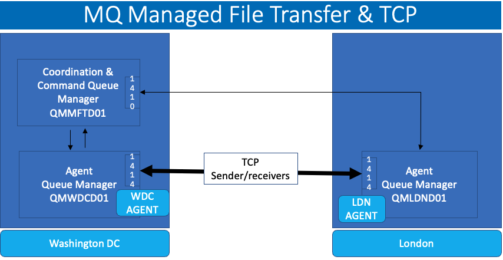
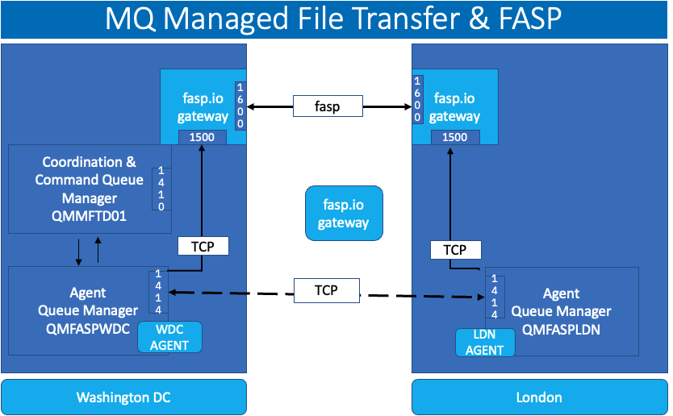
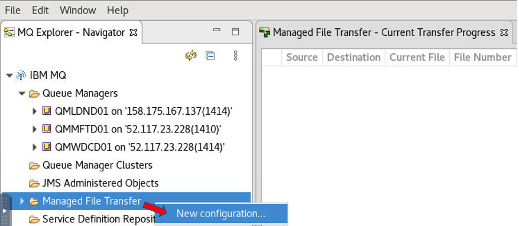
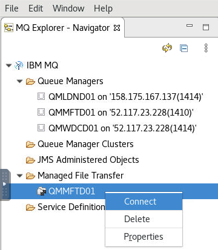
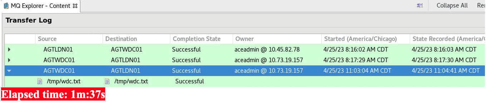
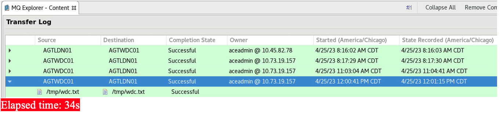

# IBM MQ Managed File Transfering (MFT) & Aspera FASP.IO Gateway


NOTE: <br>
This lab is a continuation of mq-faspio lab. Please finish "IBM MQ Messaging & Aspera FASP.IO Gateway Lab" before starting this lab. <br>
<br>

## 1. Overview

The purpose of this lab to demonostrate the benefit of using Aspera fasp.io Gateway with IBM MQFTE over TCP.

At a high level, we will be using two VM's, one in Washington DC-United States, and another in London-United Kingdom.

You will be testing two usecases. 
<br>
a) Send large messages with MQ with TCP <br>
b) Send large messages with MQ with FASP over TCP
<br>
<br>

## 2. Use Cases

### 2.1 Use case 1: Transfer files using TCP



<br>

### 2.2 Use case 2: Transfer files using FASP



<br>


## 3. Create Managed File Transfer Queue Manager

Run the below commands on the Washington VM. <br>
```
crtmqm QMMFTD01
strmqm QMMFTD01
runmqsc QMMFTD01

alter qmgr chlauth(disabled)
alter qmgr connauth(' ')
refresh security (*) 

def listener(listener.1410) trptype(tcp) port(1410) control(qmgr)

start listener(listener.1410)

def channel(MFT.SVRCONN) CHLTYPE(SVRCONN) MAXMSGL(104857600)

# mft to wdc agent channel
def channel(mft.wdc) chltype(sdr) conname('localhost(1414)') XMITQ(QMWDCD01) MAXMSGL(104857600) 

def channel(mft.ldn) chltype(sdr) conname('yy.yy.yy.yy(1414)') XMITQ(QMLDND01) MAXMSGL(104857600) 
start chl(mft.wdc)
start chl(mft.ldn) 

def chl(wdc.mft) chltype(rcvr)  MAXMSGL(104857600)
def chl(ldn.mft) chltype(rcvr)  MAXMSGL(104857600)

def qlocal(QMWDCD01) maxmsgl(104857600) usage(xmitq) INITQ(SYSTEM.CHANNEL.INITQ) TRIGDATA(MFT.WDC)

def qlocal(QMLDND01) maxmsgl(104857600) usage(xmitq) INITQ(SYSTEM.CHANNEL.INITQ) TRIGDATA(MFT.LDN)
end

fteSetupCoordination -coordinationQMgr QMMFTD01 -f

runmqsc QMMFTD01 < /var/mqm/mqft/config/QMMFTD01/QMMFTD01.mqsc

fteSetupCommands -connectionQMgr QMMFTD01 -f

```


## 4. Connect Coordination & Command Queue Manager with the Agent Queue Managers

Run the below commands on the Washington & London Queue Managers.<br>

<table>
    <thead>
      <tr>
        <th>WDC</th>
        <th>LDN</th>
      </tr>
    </thead>
    <tbody>
        <tr>
            <td>runmqsc QMWDCD01

Def chl(wdc.mft) CHLTYPE(SDR) conname('localhost(1410)')  xmitq(QMMFTD01) MAXMSGL(104857600)

def qlocal(QMMFTD01) maxmsgl(104857600) usage(xmitq) INITQ(SYSTEM.CHANNEL.INITQ) TRIGDATA(WDC.MFT)

START CHANNEL( WDC.MFT )

DEF chl(mft.wdc) chltype(rcvr)
End

fteCreateAgent -agentname AGTWDC01 -agentQMgr QMWDCD01 -p QMMFTD01 -f

runmqsc QMWDCD01 < /var/mqm/mqft/config/QMMFTD01/agents/AGTWDC01/AGTWDC01_create.mqsc
</td>
            <td>runmqsc QMLDND01

Def chl(ldn.mft) CHLTYPE(SDR) conname('xx.xx.xx.xx(1410)')  xmitq(QMMFTD01) MAXMSGL(104857600)

def qlocal(QMMFTD01) maxmsgl(104857600) usage(xmitq) INITQ(SYSTEM.CHANNEL.INITQ) TRIGDATA(LDN.MFT)

DEF chl(mft.ldn) chltype(rcvr)

START CHANNEL( LDN.MFT ) 
end

fteSetupCoordination -coordinationQMgr QMMFTD01 -coordinationQMgrHost xx.xx.xx.xx -coordinationQMgrPort 1410 -coordinationQMgrChannel MFT.SVRCONN -f

fteSetupCommands -connectionQMgr QMMFTD01 -connectionQMgrHost xx.xx.xx.xx -connectionQMgrPort 1410 -connectionQMgrChannel MFT.SVRCONN -f

fteCreateAgent -agentname AGTLDN01 -agentQMgr QMLDND01 -f

runmqsc QMLDND01 < /var/mqm/mqft/config/QMMFTD01/agents/AGTLDN01/AGTLDN01_create.mqsc
</td>
        </tr>
    </tbody>
  </table>


<b> Verify Agents are in READY state.</b><br>
```
$ fteListAgents 
Agent Name:    Queue Manager Name:     Status:     Status Age:
AGTLDN01       QMLDND01                READY           0:03:30
AGTWDC01       QMWDCD01                READY           0:01:39
```
<b> Start the Agents.</b><br>

<table>
    <thead>
      <tr>
        <th>WDC</th>
        <th>LDN</th>
      </tr>
    </thead>
    <tbody>
        <tr>
            <td>fteStartAgent AGTWDC01</td>
            <td>fteStartAgent AGTLDN01</td>
        </tr>
    </tbody>
  </table>

<br>

## 4. Testing TCP Transfers

This is use case 1, see architecture diagram under section 2.1.
<br>
Run the following commands from Washington VM, and London VM.<br>
### 4.1 Transfer Zero bytes file 
<table>
    <thead>
      <tr>
        <th>WDC</th>
        <th>LDN</th>
      </tr>
    </thead>
    <tbody>
        <tr>
            <td> touch /tmp/test1.txt

fteCreateTransfer -rt -1 -jn "test-wdc-ldn-1" -sa AGTWDC01 -sm QMWDCD01 -da AGTLDN01 -dm QMLDND01 -sd delete -dd "/tmp/" "/tmp/test1.txt" -de overwrite
</td>
            <td>ls -l /tmp 

Make sure test1.txt is transferred.</td>
        </tr>
    </tbody>
  </table>

### 4.2 Transfer 1GB file

Run the following commands from Washington VM, and London VM.<br>

<table>
    <thead>
      <tr>
        <th>WDC</th>
        <th>LDN</th>
      </tr>
    </thead>
    <tbody>
        <tr>
            <td>dd if=/dev/zero of=/tmp/wdc.txt bs=1024 count=1048576

fteCreateTransfer -rt -1 -jn "test-wdc-ldn-1" -sa AGTWDC01 -sm QMWDCD01 -da AGTLDN01 -dm QMLDND01 -sd delete -dd "/tmp/" "/tmp/wdc.txt " -de overwrite
</td>
            <td>ls -l /tmp

Make sure test1.txt is transferred.</td>
        </tr>
    </tbody>
  </table>

<br>

### 4.3 MQExplorer - Verify Transfer Status 

Open MQExplorer on Washington VM. <br>

Add all three Queue Managers.<br>

<b>Add QMMFTD01 Managed File Transfer Configuration as below.</b><br>

For the Coordination Queue Manager > Choose QMMFTD01.<br>
For the Command Queue Manager > Choose QMMFTD01.<br>
For the Configuration Name, choose default value QMMFTD01.<br>
<br>
<b>Connect to QMMFTD01 Managed File Transfer Configuration as below.</b><br>




#### Click on Transfer Log 




<br><br>


## 5. fasp.io - configuration 

This is use case 2, see architecture diagram under section 2.2.
<br>
Configure Channels to route traffic to the fasp.io Gateway.<br>

<table>
    <thead>
      <tr>
        <th>WDC</th>
        <th>LDN</th>
      </tr>
    </thead>
    <tbody>
        <tr>
            <td>STOP CHL(WDC.LDN)

DIS CHSTATUS(WDC.LDN)

alter chl(WDC.LDN) CHLTYPE(SDR) CONNAME('xx.xx.xx.xx(1500)')

START CHL(WDC.LDN)
</td>
            <td>STOP CHL(LDN.WDC)

DIS CHSTATUS(LDN.WDC)

alter chl(ldn.wdc) CHLTYPE(SDR) CONNAME('yy.yy.yy.yy(1500)')

START CHL(LDN.WDC)
</td>
        </tr>
    </tbody>
  </table>


<br>

## 6. Testing FASP Transfers


### 6.1 Transfer Zero bytes file 
<table>
    <thead>
      <tr>
        <th>WDC</th>
        <th>LDN</th>
      </tr>
    </thead>
    <tbody>
        <tr>
            <td> touch /tmp/test1.txt

fteCreateTransfer -rt -1 -jn "test-wdc-ldn-1" -sa AGTWDC01 -sm QMWDCD01 -da AGTLDN01 -dm QMLDND01 -sd delete -dd "/tmp/" "/tmp/test1.txt" -de overwrite
</td>
            <td>ls -l /tmp 

Make sure test1.txt is transferred.</td>
        </tr>
    </tbody>
  </table>

### 6.2 Transfer 1GB file

<table>
    <thead>
      <tr>
        <th>WDC</th>
        <th>LDN</th>
      </tr>
    </thead>
    <tbody>
        <tr>
            <td>dd if=/dev/zero of=wdc.txt bs=1024 count=1048576

fteCreateTransfer -rt -1 -jn "test-wdc-ldn-1" -sa AGTWDC01 -sm QMWDCD01 -da AGTLDN01 -dm QMLDND01 -sd delete -dd "/tmp/" "/tmp/wdc.txt " -de overwrite
</td>
            <td>ls -l /tmp

Make sure test1.txt is transferred.</td>
        </tr>
    </tbody>
  </table>


### 6.3 MQExplorer - Verify Transfer Status 

Open MQExplorer on Washington VM, and verify Transfer log. <br>




Now compare the difference between TCP Transfer, and FASP.IO gateway transfer of 1GB file. You should see 60-65% transfer rate increase.


<br><br>

## Congratulations!!!
## You have successfully completed the MQ File Transfers using fasp.io MQ Advanced module !!!


