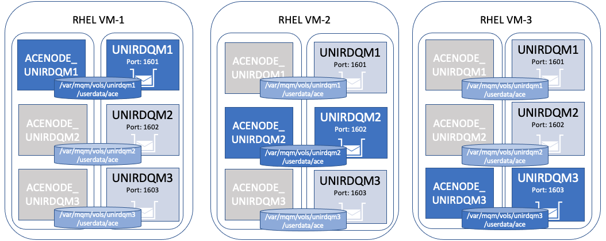
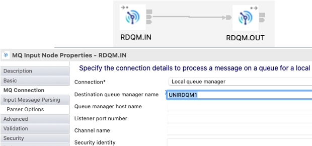
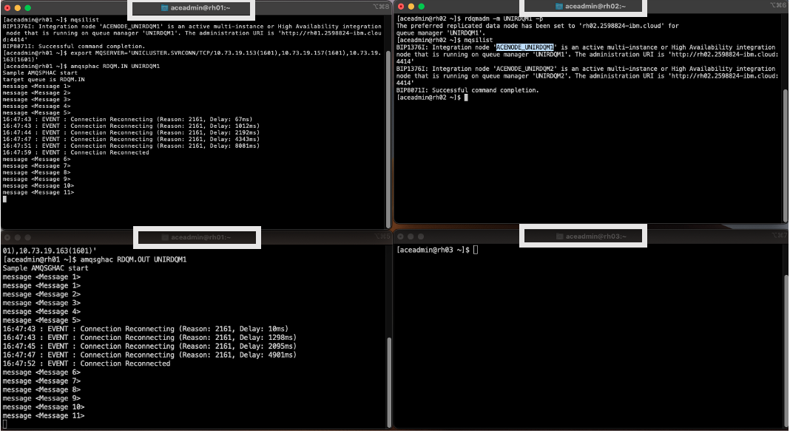
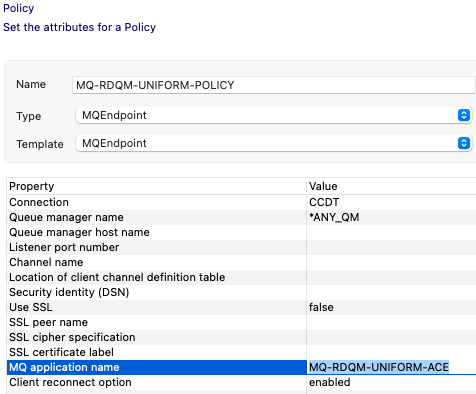
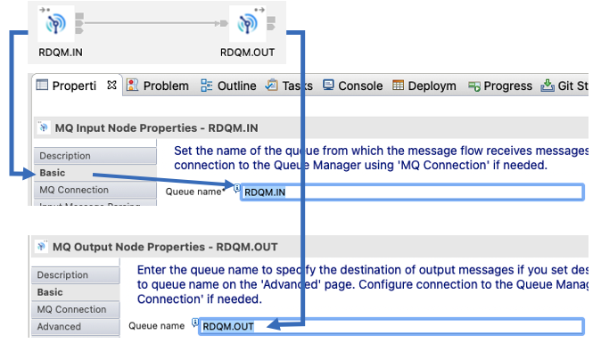
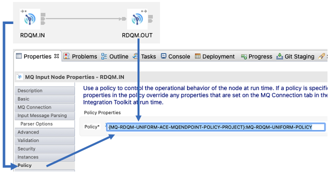

# IBM MQ Uniform Cluster + RDQM HA + App Connect - Proof of Technology

## 1. Overview

This Proof of Technology demo combines IBM MQ Replicated Data Queue Manager (RDQM), and App Connect Enterprise (ACE) for High Avaailability. This will explain how to configure ACE Node and failover along with the RDQM Queue Manager.



Please refer to the below article on how to setup RDQM Queue Manager. <br>
https://github.ibm.com/Sudhakar-Bodapati/labs-integration/tree/main/mq/mq-rdqm-uniform
<br>

## 2. App Connect Enterprise Install
Download App Connect 12.0.6.0 (12.0-ACE-LINUXX64-12.0.6.0.tar.gz) from the IBM Fix Central.<br>
Transfer the file to all 3 Virtual Machines.<br>
Run the below commands to install App Connect Enterprise.
```
As root,
tar -xzvf 12.0-ACE-LINUXX64-12.0.6.0.tar.gz --exclude ace-12.0.6.0/tools
mkdir /opt/IBM
mv ace-12.0.6.0 /opt/IBM
cd /opt/IBM/ace-12.0.6.0
./ace make registry global accept license  silently 
chown -R aceadmin:mqbrkrs /opt/IBM/ace-12.0.6.0
usermod -a -G mqbrkrs aceadmin

# Configure ACE logs to be sent to user.log
vi /etc/rsyslog.conf (append below two lines)
# App Connect Enterprise Logs
user.info /var/log/user.log
Save the file, and run the below two commands
touch /var/log/user.log
chmod 766 /var/log/user.log

# Restart rsyslog process
systemctl restart rsyslog

# Update aceadmin profile to run mqsiprofile 
su - aceadmin
Add below line to "aceadmin" user's .bash_profile
. /opt/IBM/ace-12.0.6.0/server/bin/mqsiprofile
exit
su - aceadmin
```

Repeat the above on VM2, and VM3 <br>
<br>

## 3. Create App Connect High Availability Node

SSH into VM1.<br>
Make sure UNIRDQM1 queue manager is running on VM1. Run the below commands to create ACE Node.<br>
```
sudo mkdir /var/mqm/vols/unirdqm1/userdata
sudo mkdir /var/mqm/vols/unirdqm1/userdata/ace
mqsicreatebroker -e /var/mqm/vols/unirdqm1/userdata/ace -d defined -q UNIRDQM1 ACENODE_UNIRDQM1
sudo chmod -R 775 /var/mqm/vols/unirdqm1/userdata/ace
sudo chown -R mqm:mqbrkrs /var/mqsi/registry/ACENODE_UNIRDQM1
sudo chown -R mqm:mqbrkrs /var/mqm/vols/unirdqm1/userdata/ace
mqsichangeproperties ACENODE_UNIRDQM1 -b BrokerRegistry -n mqCCDT -v '/var/mqm/vols/unirdqm1/userdata/ace/myccdt/ccdt-internal.json'
mqsistart ACENODE_UNIRDQM1
mqsicreateexecutiongroup -e default ACENODE_UNIRDQM1
mqsilist
# Make sure ACENODE_UNIRDQM1 is started. if not check logs under /var/mqsi/common/log folder.
```

Create ACENODE_UNIRDQM1 instances on the standby Nodes.<br><br>

SSH into VM2.<br>
```
# Switch UNIRDQM1 to run on VM2
rdqmadm -m UNIRDQM1 -p
mqsiaddbrokerinstance ACENODE_UNIRDQM1 -e /var/mqm/vols/unirdqm1/userdata/ace
sudo chown -R mqm:mqbrkrs /var/mqsi/registry/ACENODE_UNIRDQM1
```

SSH into VM3.<br>
```
# Switch UNIRDQM1 to run on VM2
rdqmadm -m UNIRDQM1 -p
mqsiaddbrokerinstance ACENODE_UNIRDQM1 -e /var/mqm/vols/unirdqm1/userdata/ace
sudo chown -R mqm:mqbrkrs /var/mqsi/registry/ACENODE_UNIRDQM1
```

<br>
Finally, now switch the Queue Manager to run on the Primary Node (VM1). <br>

```
# vm1
runmqadm -m UNIRDQM1 -p
# Run mqsilist command, and make sure the ACENODE is up and running.
```

REPEAT the above steps to create ACENODE_UNIRDQM2, ACENODE_UNIRDQM3 on all Nodes.<br>
Create ACENODE_UNIRDQM2 on VM2, and standby setup on VM1, VM3 <br>
Create ACENODE_UNIRDQM3 on VM3, and standy setup on VM1, VM2 <br>
<br><br>

## 4. Sample Flow - Using Local Queue Manager
It's a very simple message flow to read messages from RDQM.IN Queue, and writes to RDQM.OUT Queue.<br>



### 4.1 Deploy Sample Flow

Download the **RDQM_MQIN_MQOUT_PI.zip** <br>
    Click here and save the zip file - [RDQM_MQIN_MQOUT_PI.zip](./source/RDQM_MQIN_MQOUT_PI.zip)

Download the **RDQM_MQIN_MQOUT.bar** <br>
    Click here and save the bar file - [RDQM_MQIN_MQOUT.bar](./barfiles/RDQM_MQIN_MQOUT.bar)
<br><br>
Transfer bar file to VM1, also create RDQM.IN, RDQM.OUT Queues.<br>
```
# Run the below commands on VM1
echo "def qlocal(RDQM.IN) cluster(unicluster) defpsist(yes) defbind(notfixed) clwluseq(any)" | runmqsc UNIRDQM1

echo "def qlocal(RDQM.OUT) cluster(unicluster) defpsist(yes) defbind(notfixed) clwluseq(any)" | runmqsc UNIRDQM1

# Deploy bar file
mqsideploy ACENODE_UNIRDQM1 -e default -a RDQM_MQIN_MQOUT.bar

[aceadmin@rh01 ~]$ mqsilist ACENODE_UNIRDQM1 -r
-----------------------------------
BIP1286I: Integration server 'default' on integration node 'ACENODE_UNIRDQM1' is running.
BIP1275I: Application 'RDQM_MQIN_MQOUT_Sample_Application' on integration server 'default' is running.
BIP1277I: Message flow 'RDQM_MQIN_MQOUT_MSGFLOW' on integration server 'default' is running. (Application 'RDQM_MQIN_MQOUT_Sample_Application', Library '')
BIP8071I: Successful command completion.
```

### 4.2 Testing Sample Flow

Make sure the App Connect Node is failed over along with the RDQM Queue Manager.
Open two SSH sessions for VM1. <br>
Open one SSH session for VM2.<br>
```
# vm1-session1
[aceadmin@rh01 ~]$ mqsilist
BIP1376I: Integration node 'ACENODE_UNIRDQM1' is an active multi-instance or High Availability integration node that is running on queue manager 'UNIRDQM1'.
BIP8071I: Successful command completion.

[aceadmin@rh01 ~]$ export MQSERVER='UNICLUSTER.SVRCONN/TCP/10.73.xx.xxx(1601),10.73.xx.xxx(1601),10.73.xx.xxx(1601)'
[aceadmin@rh01 ~]$ amqsphac RDQM.IN UNIRDQM1
```
```
# vm1-session2
[aceadmin@rh01 ~]$ export MQSERVER='UNICLUSTER.SVRCONN/TCP/10.73.xx.xxx(1601),10.73.xx.xxx(1601),10.73.xx.xxx(1601)'
[aceadmin@rh01 ~]$ amqsghac RDQM.OUT UNIRDQM1
```

Failover UNIRDQM1 to VM2, notice that ACENODE_UNIRDQM1 is also failsover aslong with the RDQM Queue Manager onto VM2.<br>
```
# vm2
[aceadmin@rh01 ~]$ rdqmadm -m UNIRDQM1 -p
```

Notice that vm1-session1, and vm1-session2 Queue Manager is reconnected automatically. If the ACENODE_UNIRDQM1 is started successfully on VM2, then vm1-session2 should continue to read messages from RDQM.OUT queue like in the screenshot below.<br>




## 5. Sample flow using MQ CCDT

This sample flow will be using the Client Channel Definition Table (ccdt-internal.json) to connect to any of the 3 RDQM/UniformCluster Queue Managers. <br>

Download the **RDQM_MQIN_MQOUT_CCDT_PI.zip** <br>
    Click here and save the zip file - [RDQM_MQIN_MQOUT_CCDT_PI.zip](./source/RDQM_MQIN_MQOUT_CCDT_PI.zip)

Download the **RDQM_MQIN_MQOUT_CCDT.bar** <br>
    Click here and save the zip file - [RDQM_MQIN_MQOUT_CCDT.bar](./barfiles/RDQM_MQIN_MQOUT_CCDT.bar)

<br>

### Review the message flow
Open App Connect Toolkit.<br>
Import the Project interchange file into the App Connect Toolkit <br>

### 5.1 MQ Endpoint Policy
Open Policy Project MQ-RDQM-UNIFORM-ACE-MQENDPOINT-POLICY-PROJECT & Policy MQ-RDQM-UNIFORM-POLICY.policyxml and review the configuration.



### 5.2 Message Flow
Open Applicaiton RDQM_MQIN_MQOUT_Sample_Application_CCDT, Message Flow RDQM_MQIN_MQOUT_CCDT_MSGFLOW.msgflow and review the configuration.





<br>

### 5.3 Deployment

Deploy the bar file on all 3 Brokers.<br>

```
# Copy the ccdt-internal.json to rdqm mq directory.
[aceadmin@rh01]$ mkdir /var/mqm/vols/unirdqm1/userdata/ace/myccdt
[aceadmin@rh01]$ cp ccdt-internal.json /var/mqm/vols/unirdqm1/userdata/ace/myccdt/ccdt-internal.json
[aceadmin@rh01]$ sudo chown -R mqm:mqbrkrs /var/mqm/vols/unirdqm1/userdata/ace/myccdt

[aceadmin@rh01 ~]$ mqsilist ACENODE_UNIRDQM1 -e default
BIP1275I: Application 'RDQM_MQIN_MQOUT_Sample_Application' on integration server 'default' is running.
BIP8071I: Successful command completion.

# Stop the RDQM_MQIN_MQOUT_Sample_Application Application.

[aceadmin@rh01 ~]$ mqsistopmsgflow ACENODE_UNIRDQM1 -e default -k RDQM_MQIN_MQOUT_Sample_Application

# Make sure it's stopped
[aceadmin@rh01 ~]$ mqsilist ACENODE_UNIRDQM1 -e default
BIP1276I: Application 'RDQM_MQIN_MQOUT_Sample_Application' on integration server 'default' is stopped.
BIP8071I: Successful command completion.


# Deploy the Sample Application to use CCDT

[aceadmin@rh01 ~]$ mqsideploy ACENODE_UNIRDQM1 -e default -a RDQM_MQIN_MQOUT_CCDT.bar
BIP1039I: Deploying BAR file '/home/aceadmin/RDQM_MQIN_MQOUT_CCDT.bar' to integration node 'ACENODE_UNIRDQM1' (integration server 'default') ...
BIP9332I: Application 'RDQM_MQIN_MQOUT_Sample_Application_CCDT' has been created successfully.
BIP1092I: The deployment request was processed successfully.
```
REPEAT the above deployment commands on Node2, Node3.<br>

### 5.4 Validation

```
# Make sure there aren't any errors in user.log
[aceadmin@rh01 ~]$ tail -n 100 /var/log/user.log

# Check and make sure the 3 connections are distributed across the 3 Queue Managers
[aceadmin@rh01 ~]$ echo "dis conn(*) where(appltag eq 'MQ-RDQM-UNIFORM-ACE') all" | runmqsc UNIRDQM1

[aceadmin@rh02 ~]$ echo "dis conn(*) where(appltag eq 'MQ-RDQM-UNIFORM-ACE') all" | runmqsc UNIRDQM2

[aceadmin@rh03 ~]$ echo "dis conn(*) where(appltag eq 'MQ-RDQM-UNIFORM-ACE') all" | runmqsc UNIRDQM3

(OR) 
# Run apstatus command and notice BALANCED is set to YES

[aceadmin@rh01 ~]$ echo "dis apstatus('MQ-RDQM-UNIFORM-ACE')  " | runmqsc UNIRDQM1
5724-H72 (C) Copyright IBM Corp. 1994, 2022.
Starting MQSC for queue manager UNIRDQM1.


     1 : dis apstatus('MQ-RDQM-UNIFORM-ACE')  
AMQ8932I: Display application status details.
   APPLNAME(MQ-RDQM-UNIFORM-ACE)           CLUSTER(UNICLUSTER)
   COUNT(3)                                MOVCOUNT(3) 
   BALANCED(YES)                           TYPE(APPL)

# Run apstatus typ(qmgr), and notice the connections are distributed across all 3 qmgrs.
[aceadmin@rh01 ~]$ echo "dis apstatus('MQ-RDQM-UNIFORM-ACE') type(qmgr)" | runmqsc UNIRDQM1
     1 : dis apstatus( 'RDQMIN_UNIFORM') type(qmgr)
AMQ8932I: Display application status details.
   APPLNAME(RDQMIN_UNIFORM)                ACTIVE(YES)
   COUNT(1)                                MOVCOUNT(1) 
   BALSTATE(OK)                            LMSGDATE(2022-11-21)
   LMSGTIME(08.10.30)                      QMNAME(UNIRDQM1)
   QMID(UNIRDQM1_2022-11-15_08.23.38)      TYPE(QMGR)
AMQ8932I: Display application status details.
   APPLNAME(RDQMIN_UNIFORM)                ACTIVE(YES)
   COUNT(1)                                MOVCOUNT(1) 
   BALSTATE(OK)                            LMSGDATE(2022-11-21)
   LMSGTIME(08.09.56)                      QMNAME(UNIRDQM2)
   QMID(UNIRDQM2_2022-11-15_08.23.54)      TYPE(QMGR)
AMQ8932I: Display application status details.
   APPLNAME(RDQMIN_UNIFORM)                ACTIVE(YES)
   COUNT(1)                                MOVCOUNT(1) 
   BALSTATE(OK)                            LMSGDATE(2022-11-21)
   LMSGTIME(08.09.57)                      QMNAME(UNIRDQM3)
   QMID(UNIRDQM3_2022-11-15_08.25.22)      TYPE(QMGR)
One MQSC command read.


# Check MQ log, check log entry as below
[aceadmin@rh01 ~]$ tail -f /var/mqm/vols/unirdqm1/qmgr/unirdqm1/errors/AMQERR01.LOG

EXPLANATION:
Application 'RDQMIN_UNIFORM' is not balanced but it was not possible to
identify a queue manager in cluster UNICLUSTER to which a balance request
should be sent. The local instance count is 0, and the mean instance count for
the cluster is 1.
```
If connections are distributed across the 3 Queue Managers that means the App Connect + RDQM + UNIFORM Cluster setup worked as expected. <br>


## 6. References
App Connect Info center:
Using an integration node with an RDQM configuration
https://www.ibm.com/docs/en/app-connect/12.0?topic=availability-using-integration-node-rdqm-configuration

