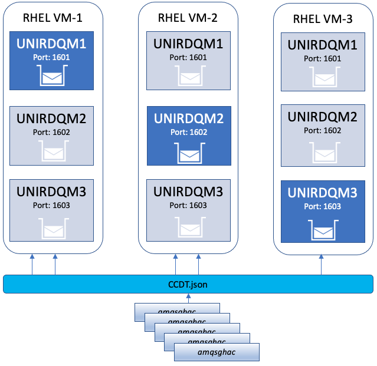
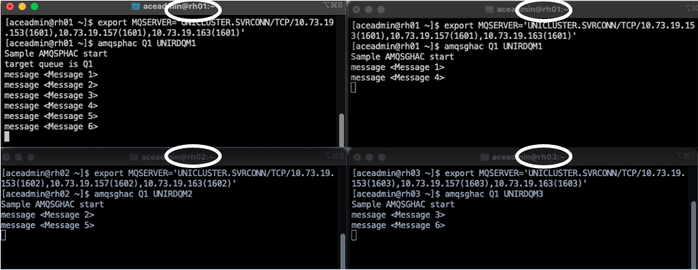
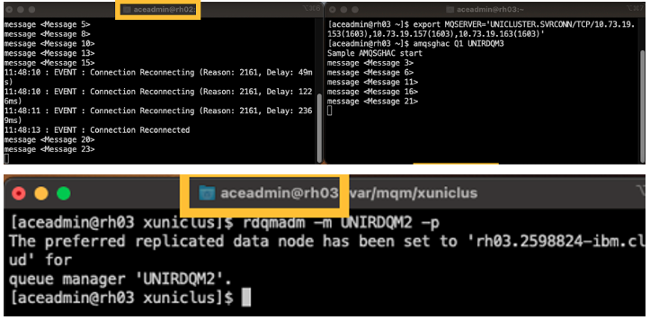

# IBM MQ Uniform Cluster + RDQM HA - Proof Of Technology

## 1. Overview

This lab combines IBM MQ Uniform Clustering with Replicated Data Queue Managers (RDQM) to acheive MQ High Availability, Clustering, and client connection load balancing. <br> 



The diagram above contains a three Node Replicated Data Queue Manager HA configuration, with an Uniform Cluster with 3 Queue Managers.<br> 
The 5 amqsghac client programs are distributed across all the three Queue Managers automatically by the Uniform Cluster.
<br><br>

## 2. Hardware / Software
a) Three Virtual Machines (x86_64) with RedHat Linux version 8 installed. <br>
b) An additional disk on each VM (5GB minimum).<br>
c) One internal & one external ip addresses.<br>
d) MQ v9.3.1

<br>

## 3. Setup

### 3.1 Create drbdpool
```
$ lsblk (Verify the second disk (xvdc) is available)
$ pvcreate /dev/xvdc
$ vgcreate drbdpool /dev/xvdc

Verify pv, and vg are created successfully.

[root@rh01 ~]# pvs
  PV         VG       Fmt  Attr PSize    PFree
  /dev/xvdc  drbdpool lvm2 a--  <100.00g <88.00g

[root@rh01 ~]# vgs
  VG       #PV #LV #SN Attr   VSize    VFree
  drbdpool   1   4   0 wz--n- <100.00g <88.00g
```

### 3.2 File/Limits Configuration
Repeat the below commands on each Virtual Machine.<br>
```
$ sudo vi /etc/sysctl.conf
    fs.file-max=524288
$ sudo sysctl -p

$ vi /etc/security/limits.conf	
mqm             hard    nproc           4096
mqm             soft    nproc           4096
mqm             hard    nofile          10240
mqm             soft    nofile          10240

$ echo 32768 > /proc/sys/kernel/threads-max

$ vi /etc/sysctl.conf
    fs.file-max=524288
$ sysctl -p

vi /etc/security/limits.conf	
mqm             hard    nproc           4096
mqm             soft    nproc           4096
mqm             hard    nofile          10240
mqm             soft    nofile          10240

$ sudo su -
$ echo 32768 > /proc/sys/kernel/threads-max
```

### 3.3 Users & Permissions

```
adduser -m aceadmin
passwd aceadmin
usermod -a -G mqm,haclient aceadmin

$ visudo (add below line on all 3 nodes)
mqm ALL=(ALL) NOPASSWD: ALL
aceadmin ALL=(ALL) NOPASSWD: ALL

$ su - aceadmin
$ vi .bash_profile
Add the below.
set -o vi
export PATH=$PATH:/opt/mqm/bin:/opt/mqm/samp/bin:
```

### 3.4 MQ installation
Upload MQ Software to the Virtual Machine.<br>

```
installation procedure:
tar -xzvf IBM_MQ_9.3.1_LINUX_X86-64.tar.gz

$ cd MQServer
Identify the kernel module
$ Advanced/RDQM/PreReqs/el8/kmod*/modver
$ yum install Advanced/RDQM/PreReqs/el8/kmod-drbd-9/kmod-drbd-9.1.11_4.18.0_372.9.1-1.x86_64.rpm -y
$ yum install Advanced/RDQM/PreReqs/el8/drbd-utils-9/* -y
$ yum install Advanced/RDQM/PreReqs/el8/pacemaker-2/* -y
./mqlicense.sh -accept
$ yum install MQSeriesGSKit* MQSeriesServer* MQSeriesRuntime* MQSeriesSamples* MQSeriesClient* -y
$ yum install Advanced/RDQM/MQSeriesRDQM* -y
```

<br>

## 4. Uniform Cluster Configuration 

### 4.1 Update rdqm.ini

Repeat this on all 3 Virtual Machines
```
$ vi /var/mqm/rdqm.ini (repeat on all 3 nodes)
Node:
  Name=rh01.ibm.local
  HA_Replication=<vm1-internal-ip>
#  HA_Primary=
#  HA_Alternate=
#  DR_Replication=
Node:
  Name=rh02.ibm.local
  HA_Replication=<vm2-internal-ip>
#  HA_Primary=
#  HA_Alternate=
#  DR_Replication=
Node:
  Name=rh03.ibm.local
  HA_Replication=<vm3-internal-ip>
#  HA_Primary=
#  HA_Alternate=
#  DR_Replication=
```

### 4.2 Initialize RDQM

```
sudo /opt/mqm/bin/rdqmadm -c (repeat on all 3 nodes)

rdqmstatus -n
 Node rh01.ibm.local is online
 Node rh02.ibm.local is online
 Node rh03.ibm.local is online
```

### 4.3 Create RDQM Queue Managers

Copy AutoCluster.ini, UniCluster.mqsc files from github config folder to /var/mqm/xuniclus. <br>
```
As root;
mkdir /var/mqm/xunisclus
cp AutoCluster.ini /var/mqm/xuniclus
cp UniCluster.ini /var/mqm/xuniclus
chown -R mqm:mqm /var/mqm/xuniclus
```

Update with the internal IP addresses in AutoCluster.ini <br>

Create RDQM + Uniform Cluster Queue Managers. <br>
```
VM3 & VM2: 
crtmqm -sxs -ii /var/mqm/xuniclus/AutoCluster.ini -ic /var/mqm/xuniclus/UniCluster.mqsc -iv CONNAME="10.73.19.xxx(1601),10.73.19.xxx(1601),10.73.19.xxx(1601)" UNIRDQM1
crtmqm -sxs -ii /var/mqm/xuniclus/AutoCluster.ini -ic /var/mqm/xuniclus/UniCluster.mqsc -iv CONNAME="10.73.19.xxx(1602),10.73.19.xxx(1602),10.73.19.xxx(1602)" UNIRDQM2
crtmqm -sxs -ii /var/mqm/xuniclus/AutoCluster.ini -ic /var/mqm/xuniclus/UniCluster.mqsc -iv CONNAME="10.73.19.xxx(1603),10.73.19.xxx(1603),10.73.19.xxx(1603)" UNIRDQM3


VM1: 
Note: by default, the queue manager is created with 3GB size.

crtmqm -sx -ii /var/mqm/xuniclus/AutoCluster.ini -ic /var/mqm/xuniclus/UniCluster.mqsc -iv CONNAME="10.73.19.xxx(1601),10.73.19.xxx(1601),10.73.19.xxx(1601)" -p 1601 UNIRDQM1
crtmqm -sx -ii /var/mqm/xuniclus/AutoCluster.ini -ic /var/mqm/xuniclus/UniCluster.mqsc -iv CONNAME="10.73.19.xxx(1602),10.73.19.xxx(1602),10.73.19.xxx(1602)" -p 1602 UNIRDQM2
crtmqm -sx -ii /var/mqm/xuniclus/AutoCluster.ini -ic /var/mqm/xuniclus/UniCluster.mqsc -iv CONNAME="10.73.19.xxx(1603),10.73.19.xxx(1603),10.73.19.xxx(1603)" -p 1603 UNIRDQM3

```

### 4.4 Check Queue Managers Status

```
$ dspmq
QMNAME(UNIRDQM1)       STATUS(Running)
QMNAME(UNIRDQM2)       STATUS(Running)
QMNAME(UNIRDQM3)       STATUS(Running)
```
Wait for the synchronization to complete to 100% for all 3 qmgrs. Verify the status using the below commands. <br>
```
rdqmstatus -m UNIRDQM1
rdqmstatus -m UNIRDQM2
rdqmstatus -m UNIRDQM3
```

Switch UNIRDQM2 to run on VM2 from VM2 command line.<br>
```
rdqmadm -m UNIRDQM2 -p
```
Switch UNIRDQM3 to run on VM3 from VM2 command line.
```
rdqmadm -m UNIRDQM3 -p
```

<br>

## 5. Testing

### 5.1 Basic MQ Cluster Test
Ensure the MQ Cluster is configured, initialized, and started successfully. Put several messages onto Q1, and make sure the messages are being distributed across all the 3 Queue Mansgers.<br>

Start 4 SSH sessions: 2 sessions for VM1, 1 for VM2, 1 for VM3. if you already have 3 sessions then you just need to start one new SSH session for VM1.<br>

Run the below command on VM1 (session 1)<br>
```
export MQSERVER='UNICLUSTER.SVRCONN/TCP/10.73.19.xxx(1601),10.73.19.xxx(1601),10.73.19.xxx(1601)'
amqsphac Q1 UNIRDQM1
```

Run the below command on VM1 (session 2)<br>

```
export MQSERVER='UNICLUSTER.SVRCONN/TCP/10.73.19.xxx(1601),10.73.19.xxx(1601),10.73.19.xxx(1601)'
amqsghac Q1 UNIRDQM1
```

Run the below command on VM2<br>
```
export MQSERVER='UNICLUSTER.SVRCONN/TCP/10.73.19.xxx(1601),10.73.19.xxx(1601),10.73.19.xxx(1601)'
amqsghac Q1 UNIRDQM1
```

Run the below command on VM3<br>
```
export MQSERVER='UNICLUSTER.SVRCONN/TCP/10.73.19.xxx(1601),10.73.19.xxx(1601),10.73.19.xxx(1601)'
amqsghac Q1 UNIRDQM1
```




<br>

### 5.2 RDQM Failover 
In this test, lets move UNIRDQM2 to VM3 and make sure the amqsghac, and amqsphac client connections are disconnected & reconnected to VM3.<br>
<br>
Start new SSH Session to VM3, logon as "aceadmin" user.
```
$ runmqadm -m UNIRDQM3 -p
```


<br>

### 5.3 Using Client Channel Definition Table (CCDT)
In this test, let's use Client Channel Definition Table (CCDT) file ccdt-internal.json, and watch how the client connections from MY.GETTER.APP will be automatically balanced between the three RDQM Queue Managers.<br>

Copy ccdt-internal.json file (in the github test folder) to a local directory on VM1.
Update IP addresses to the internal IP addresses of VM1, VM2, and VM3 <br>

```
export MQCCDTURL='./ccdt-internal.json'
export MQAPPLNAME='MY.GETTER.APP'

Run below command 5 times.
amqsghac Q1 *ANY_QM & 
```
Review the how the MY.GETTER.APP client connections are balanced: <br>
VM1
```
echo "dis conn(*) where(appltag eq 'MY.GETTER.APP')" | runmqsc UNIRDQM1

You should see two connections UNIRDQM1 like below.
AMQ8276I: Display Connection details.
   CONN(B961756301650040)
   EXTCONN(414D5143554E495244514D3120202020)
   TYPE(CONN)
   APPLTAG(MY.GETTER.APP)
AMQ8276I: Display Connection details.
   CONN(B961756304640040)
   EXTCONN(414D5143554E495244514D3120202020)
   TYPE(CONN)
   APPLTAG(MY.GETTER.APP)


See BALANCED is set to YES. This will verify if the MY.GETTER.APP connections are balanced across all 3 qmgrs.

echo "dis apstatus('MY.GETTER.APP')" | runmqsc UNIRDQM1

AMQ8932I: Display application status details.
   APPLNAME(MY.GETTER.APP)                 CLUSTER(UNICLUSTER)
   COUNT(5)                                MOVCOUNT(5)
   BALANCED(YES)                           TYPE(APPL)
```

Run the conn(*), and apstatus commands on VM2, and VM3 as well.<br>

<br>

## 6. Troubleshooting
a) Incase the Queue Manager couldn't be started, and if you get AMQ3680E: The HA subsystem was unable to start replicated data queue manager <insert_3>.
<br>
<br>
Workaround:
```
crm status
crm resource cleanup
```