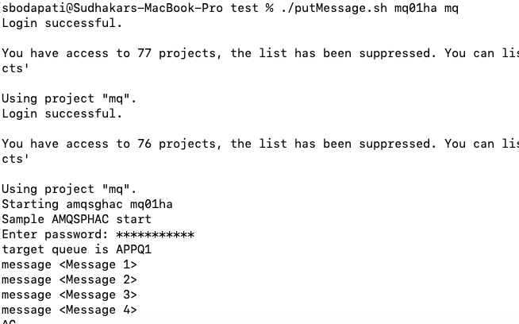
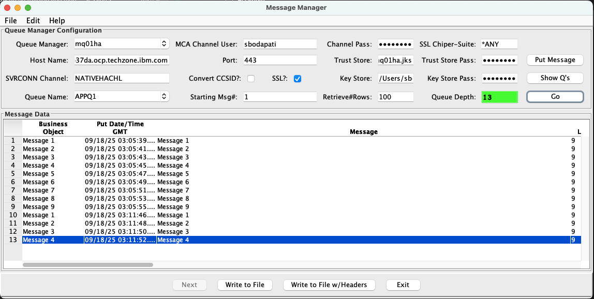
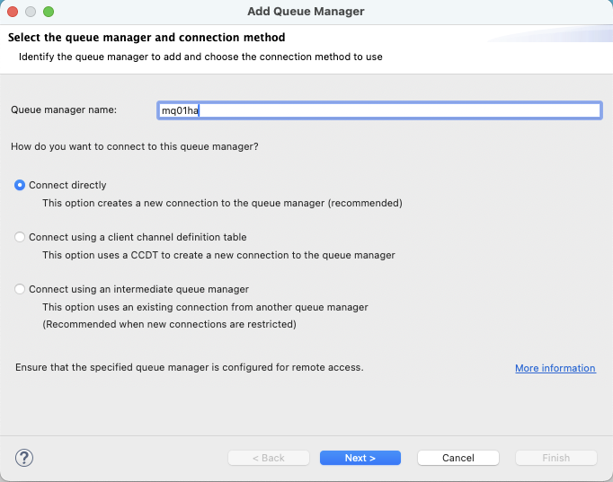
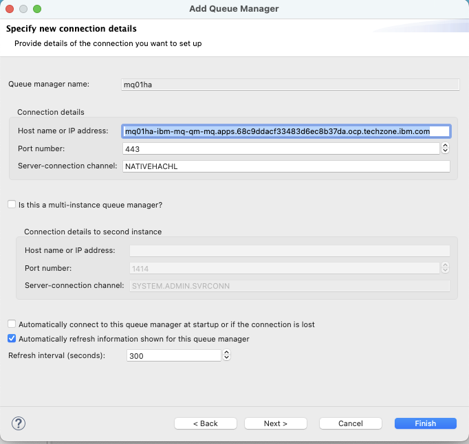
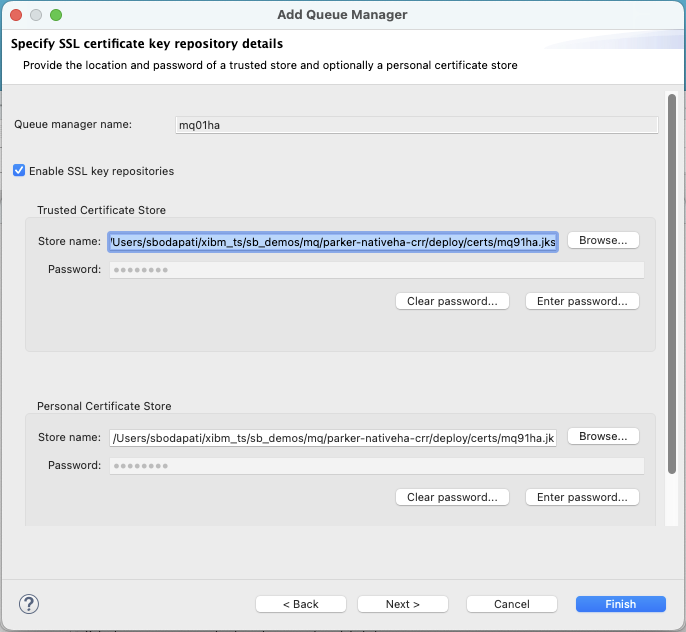
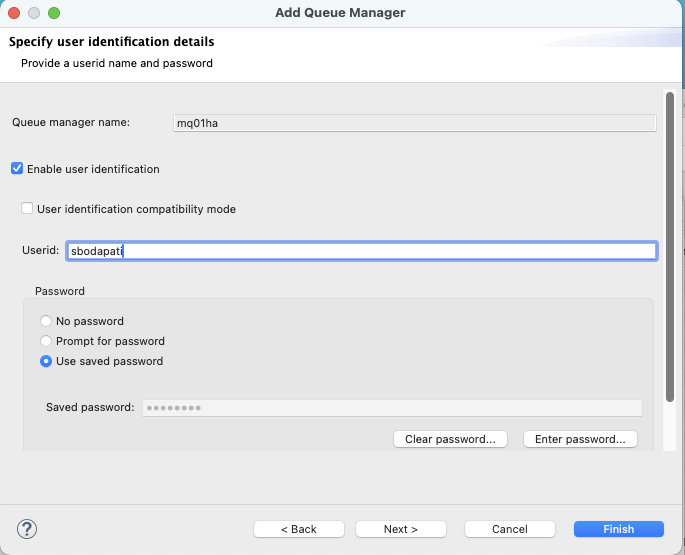
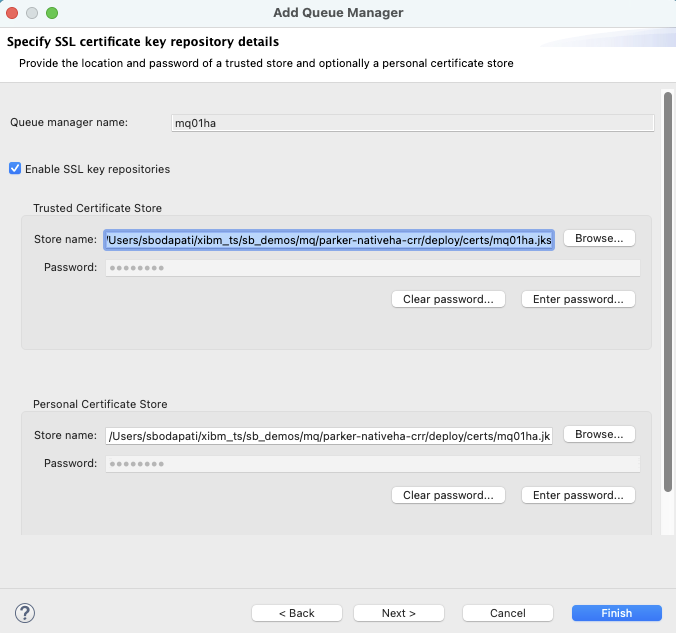
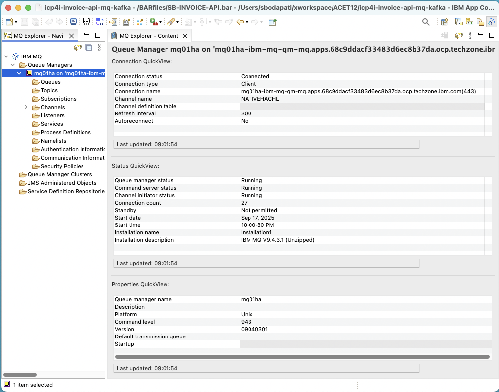

# MQ Security - Containers

---

# Table of Contents
- [1. Overview](#overview)
- [2. Using LDAP](#ldap)
    * [2.1. OpenLDAP](#openldap)
    * [2.2. Create Queue Manager](#create-qmgr)
    * [2.3. Enable Queue Manager to use LDAP](#enable-qmgr-ldap)
    * [2.4. Granting authority to queue manager](#grant-qmgr-access)
    * [2.5. Validate LDAP Connectivity](#validate-ldap-clients)
        * [2.5a. runmqsc command line](#validate-ldap-runmqsc)
        * [2.5b. amqsphac & amqsghac](#validate-ldap-amqspghac)
        * [2.5c. Sudhakar Bodapati's Message Manager ](#validate-ldap-msgmanager)
        * [2.5d. IBM MQ Explorer](#validate-ldap-mqexplorer)
- [3. Using Mutual TLS ](#mtls)
- [4. using JWT ](#jwt)
- [5. Web Console Security ](#webconsole-security)

---

## 1. Overview

IBM® MQ in containers can be configured to authenticate users through LDAP, Mutual TLS, or a custom MQ plugin.
<br>

**Note that the IBM MQ Operator does not allow the use of operating system users and groups within the container image. For more information, see Security constraints on the use of operating system users in containers.**
<br>

References: <br>
User authentication and authorization for IBM MQ in containers: <br>
https://www.ibm.com/docs/en/ibm-mq/9.4.x?topic=containers-user-authentication-authorization-mq-in
<br>


## 2. Using LDAP <a name="ldap"></a>

### 2.1 OpenLDAP <a name="openldap"></a>

Install openldap onto openshift cluster. <br>


### 2.2 Create Queue Manager <a name="create-qmgr"></a>

Create Queue Manager on OpenShift/Kubernetes. Do NOT use MQSNOAUT configuration. You have to recreate the queue manager if you create the qmgr with MQSNOAUT. <br>


### 2.3 Enable Queue Manager to use LDAP <a name="enable-qmgr-ldap"></a>

```
DEFINE AUTHINFO(USE.LDAP) +
AUTHTYPE(IDPWLDAP) +
ADOPTCTX(YES) +
CONNAME('ldap://openldap.openldap.svc:389') +
CHCKLOCL(OPTIONAL) +
CHCKCLNT(REQUIRED) +
CLASSGRP('groupOfUniqueNames') +
CLASSUSR('inetOrgPerson') +
FINDGRP('uniqueMember') +
BASEDNG('dc=ibm,dc=com') +
BASEDNU('dc=ibm,dc=com') +
LDAPUSER('cn=admin,dc=ibm,dc=com') +
LDAPPWD('HelloWorld!') +
SHORTUSR('sn') +
GRPFIELD('cn') +
USRFIELD('cn') +
AUTHORMD(SEARCHGRP) +
NESTGRP(YES)


ALTER QMGR CONNAUTH(USE.LDAP)

REFRESH SECURITY (*)
```


### 2.4 Granting authority to queue manager <a name="grant-qmgr-access"></a>

```
setmqaut -m mq01ha -t qmgr -g "potadmins" +connect +inq +alladm
setmqaut -m mq01ha -n "**" -t q -g "potadmins" +alladm +crt +browse +inq +put
setmqaut -m mq01ha -n "**" -t topic -g "potadmins" +alladm +crt
setmqaut -m mq01ha -n "**" -t channel -g "potadmins" +alladm +crt
setmqaut -m mq01ha -n "**" -t process -g "potadmins" +alladm +crt
setmqaut -m mq01ha -n "**" -t namelist -g "potadmins" +alladm +crt
setmqaut -m mq01ha -n "**" -t authinfo -g "potadmins" +alladm +crt
setmqaut -m mq01ha -n "**" -t clntconn -g "potadmins" +alladm +crt
setmqaut -m mq01ha -n "**" -t listener -g "potadmins" +alladm +crt
setmqaut -m mq01ha -n "**" -t service -g "potadmins" +alladm +crt
setmqaut -m mq01ha -n "**" -t comminfo -g "potadmins" +alladm +crt
setmqaut -m mq01ha -n SYSTEM.MQEXPLORER.REPLY.MODEL -t q -g "potadmins" +dsp +inq +get
setmqaut -m mq01ha -n SYSTEM.ADMIN.COMMAND.QUEUE -t q -g "potadmins" +dsp +inq +put
```

### 2.5 Validate LDAP Connectivity <a name="validate-ldap-clients"></a>

#### 2.5a runmqsc command line <a name="validate-ldap-runmqsc"></a>

```
runmqsc -u sbodapati mq01ha
password: 
Make sure you are able to be authorized.

another way, to test.
set MQSAMP_USER_ID=sbodapati
runmqsc mq01ha
```


#### 2.5b amqsphac & amqsghac <a name="validate-ldap-amqspghac"></a>

```
export MQCCDTURL="${DIR}/ccdt_generated_combined.json"
export MQSAMP_USER_ID=sbodapati
amqsphac APPQ1 mq01ha
it will ask for password, enter password. <br>
```




#### 2.5c Sudhakar Bodapati's Message Manager <a name="validate-ldap-msgmanager"></a>

```
queue manager: mq01ha
mca user: sbodapati
mca password: HelloWorld!
hostname: mq01ha-ibm-mq-qm-mq.apps.68c9ddacf33483d6ec8b37da.ocp.techzone.ibm.com
port: 443
trust store: /Users/sbodapati/xibm_ts/sb_demos/mq/parker-nativeha-crr/deploy/certs/mq01ha.jks
trust pass: passw0rd
key store: /Users/sbodapati/xibm_ts/sb_demos/mq/parker-nativeha-crr/deploy/certs/mq01ha.jks
key pass: passw0rd
queue name: APPQ1
```


<br>


#### 2.5d IBM MQ Explorer <a name="validate-ldap-mqexplorer"></a>

**connect directly**






/Users/sbodapati/xibm_ts/sb_demos/mq/parker-nativeha-crr/deploy/certs/mq01ha.jks
<br>







Click Finish & connect to the queue manager. <br>



## 3. Using Mutual TLS <a name="mtls"></a>

TBD <br>

## 4. Using JWT <a name="jwt"></a>

TBD <br>

## 5. Web Console Security <a name="webconsole-security"></a>

References:<br>
**Installing and configuring standalone IBM MQ Web Server, Web Console and messaging REST API, 9.3.5 CD in Linux (with no security, for Testing environments):**
<br>
https://www.ibm.com/support/pages/installing-and-configuring-standalone-ibm-mq-web-server-web-console-and-messaging-rest-api-935-cd-linux-no-security-testing-environments

TBD <br>

<br><br><br>

!!! Thank you !!!
